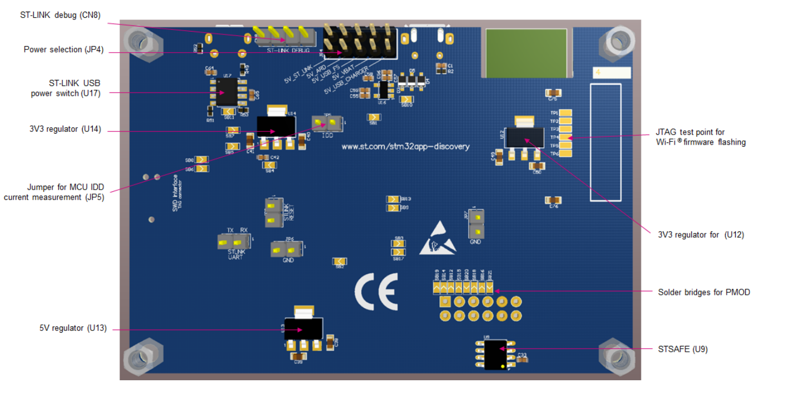
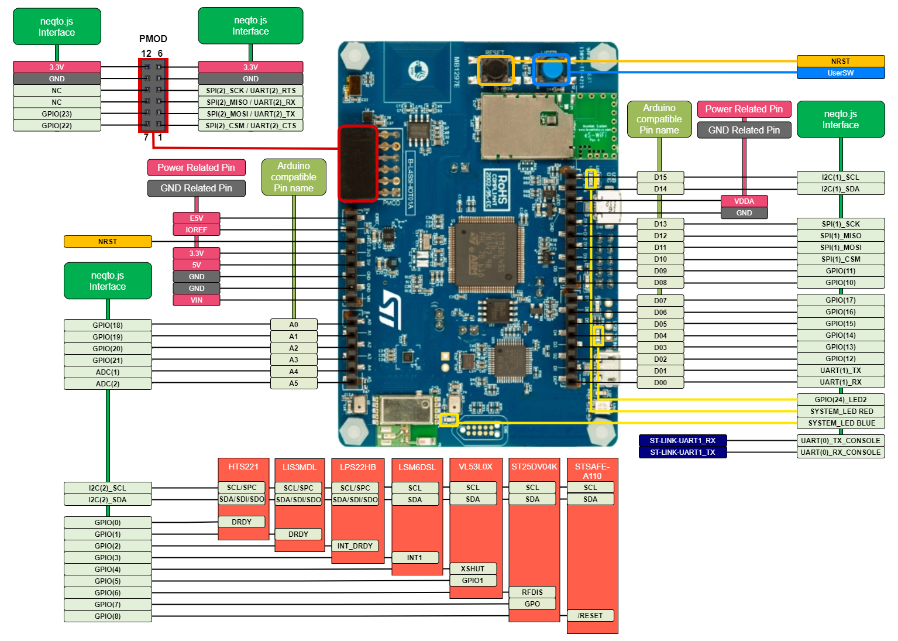
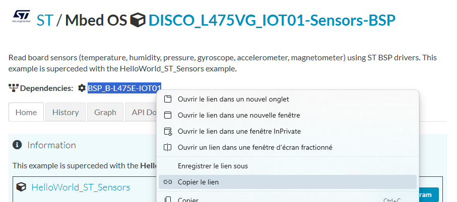
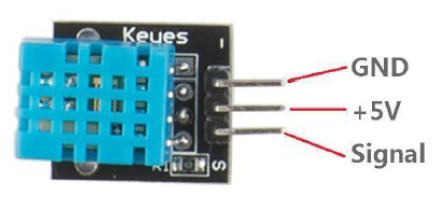
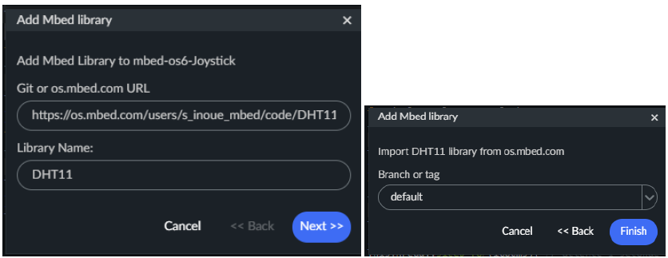
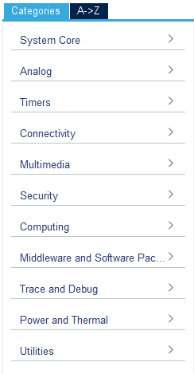
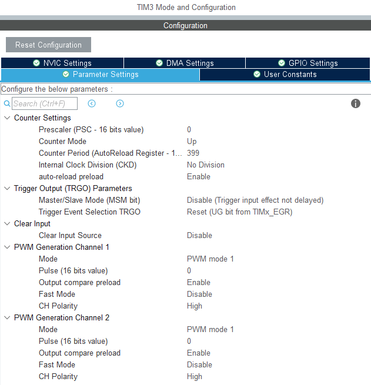
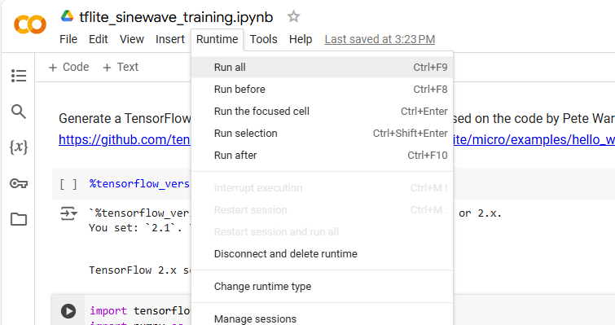

# AIoT Guidebook

<div align="center" style="padding: 0px 0;">
    <p align="center">
        <a href="https://zenodo.org/doi/10.5281/zenodo.12700232"></a>
    </p>
</div>

<div align="center" style="padding: 0px 0;">
    <p align="center">
        <a href="https://os.mbed.com/mbed-os/"></a>
        <a href="https://thingspeak.com"></a>
        <a href="https://learn.microsoft.com/en-us/cpp/c-language/?view=msvc-170"></a>  
        <a href="https://learn.microsoft.com/en-us/cpp/cpp/?view=msvc-170"></a>  
        <a href="https://docs.python.org/3/"></a>  
    </p>
</div>

<div align="center" style="padding: 0px 0;">
    <p align="center">
        <a href="https://www.st.com/en/development-tools/stm32cubeide.html"></a>
        <a href="https://www.st.com/en/embedded-software/x-cube-ai.html"></a>
        <a href="https://stm32ai-cs.st.com/home"></a>  
    </p>
</div>

This repository contains a comprehensive tutorial designed to help you develop practical applications in IoT and AI on embedded systems. Chapter 1 provides an overview of the material covered and the tools used. Chapter 2 introduces IoT by guiding you through the creation of a project involving an STM32 microcontroller, sensor interfacing, and data visualization on a cloud server using the MBed OS environment. Chapter 3 presents the STM32CubeIDE environment, offering a brief introduction to its tools and a comparison with the environment discussed in the previous chapter. Chapter 4 focuses on deploying AI models on STM32 microcontrollers, enabling you to integrate AI into your embedded applications. By following these tutorials, you'll be equipped to start your own IoT and AI projects.

# Table of Contents

- [AIoT Guidebook](#aiot-guidebook)
- [Table of Contents](#table-of-contents)
- [Chapter 1: Overview and Objectives](#chapter-1-overview-and-objectives)
  - [1. Learning Goals](#1-learning-goals)
  - [2. The Hardware and Software](#2-the-hardware-and-software)
    - [2.1 B-L475E-IOT01A Development Board](#21-b-l475e-iot01a-development-board)
    - [2.2 B-U585I-IOT02A Development Board](#22-b-u585i-iot02a-development-board)
    - [2.3 How to Program your MCU](#23-how-to-program-your-mcu)
    - [2.4 Choosing the IDE](#24-choosing-the-ide)
- [Chapter 2: Exploring MBed OS](#chapter-2-exploring-mbed-os)
  - [1. Installation and Setup](#1-installation-and-setup)
  - [2. Example Blinking a LED](#2-example-blinking-a-led)
  - [3. Example Using the Board's Internal Sensors](#3-example-using-the-boards-internal-sensors)
    - [3.1 Importing a Complete Project](#31-importing-a-complete-project)
    - [3.2 Starting from a Blank Project](#32-starting-from-a-blank-project)
  - [4. Sensors Tutorial](#4-sensors-tutorial)
    - [4.1 List of Available Sensors and Actuators](#41-list-of-available-sensors-and-actuators)
    - [4.2 Joystick Sensor](#42-joystick-sensor)
    - [4.3 Multicolor LED](#43-multicolor-led)
    - [4.4 Humidity Sensor](#44-humidity-sensor)
    - [4.5 Appendix: Example Program to Control LEDs with the Joystick](#45-appendix-example-program-to-control-leds-with-the-joystick)
  - [5. Connecting the Board to the Network via WIFI](#5-connecting-the-board-to-the-network-via-wifi)
    - [5.1 Data Transmission Standards](#51-data-transmission-standards)
    - [5.2 Compilation and Launch](#52-compilation-and-launch)
    - [5.3 General Code Routines (To Be Reused Everywhere)](#53-general-code-routines-to-be-reused-everywhere)
    - [5.4 The Application](#54-the-application)
    - [5.5 General Part of main.cpp](#55-general-part-of-maincpp)
    - [5.6 Specific Part of main.cpp](#56-specific-part-of-maincpp)
  - [6. Getting Started with ThingSpeak](#6-getting-started-with-thingspeak)
    - [6.1 Setting Up a Data Collection Server (Cloud)](#61-setting-up-a-data-collection-server-cloud)
    - [6.2 Creating the Main Communication File](#62-creating-the-main-communication-file)
- [Chapter 3: Introduction to STM32CubeIDE](#chapter-3-introduction-to-stm32cubeide)
  - [1. The Basics of STM32CubeIDE](#1-the-basics-of-stm32cubeide)
  - [2. Timer and Trigger Management in STM32CubeIDE Projects](#2-timer-and-trigger-management-in-stm32cubeide-projects)
    - [2.1 Understanding STM32 Timers and Triggers](#21-understanding-stm32-timers-and-triggers)
    - [2.2 Configuring STM32 Timers in STM32CubeMX](#22-configuring-stm32-timers-in-stm32cubemx)
    - [2.3 PWM Signal Generation Example](#23-pwm-signal-generation-example)
    - [2.4 Handling PWM Signals with Deadtimes](#24-handling-pwm-signals-with-deadtimes)
  - [3. Connecting to ThingSpeak](#3-connecting-to-thingspeak)
    - [3.1 Updating the WiFi Module Firmware](#31-updating-the-wifi-module-firmware)
    - [3.2 Understanding the Base Project and Its Configurations](#32-understanding-the-base-project-and-its-configurations)
    - [3.3 Implementing Communication with ThingSpeak](#33-implementing-communication-with-thingspeak)
- [Chapter 4: Integrating AI into Edge Devices](#chapter-4-integrating-ai-into-edge-devices)
  - [1. Overview of Embedded AI](#1-overview-of-embedded-ai)
  - [2. Exporting the Model](#2-exporting-the-model)
  - [3. Installing the X-Cube-AI Package](#3-installing-the-x-cube-ai-package)
  - [4. Project Initialization](#4-project-initialization)
  - [5. Project Configuration](#5-project-configuration)
  - [6. Writing the Code](#6-writing-the-code)
  - [7. Debugging and Uploading to STM32](#7-debugging-and-uploading-to-stm32)
- [Glossary](#glossary)
- [References](#references)

# Chapter 1: Overview and Objectives

## 1. Learning Goals

The goal of this tutorial is to design various Internet of Things (IoT) applications through experimentation, creation, and validation of functional projects. By combining technological insights with practical, hands-on project-based learning, you will gain a comprehensive understanding of the components that make up a connected system, ranging from sensor selection to data processing in cloud and Artificial Intelligence (AI).

We will utilize different electronic development boards along with two development environments: MBed OS and STM32CubeIDE. Each section of this tutorial will be dedicated to teaching essential concepts of both development environments, IoT implementations, ThingSpeak cloud, and embedded AI. These tutorials are designed to inspire you to implement your own projects.

This material covers several key areas. First, it focuses on electronic design and integration, involving the selection and integration of sensors and other electronic components. Next, it addresses processing and communication, which includes programming in C, processing on the embedded board, and implementing communication protocols. The tutorial also delves into the implementation of AI, where you will learn to use pre-trained AI models in your embedded projects. Finally, it also explores data processing and application on a server via ThingSpeak, covering data handling and visualization on a cloud-based server.

The project involves multiple steps, including specifying a connected object and a target application by describing the needs and functionalities, assembling and integrating different elements to create the object, focusing on hardware design involving sensors and the processor board, integrating the hardware with AI to determine if your model can be implemented into your project and understanding its limitations, and developing the application and its cloud environment with a focus on software design involving data processing and visualization.

## 2. The Hardware and Software

### 2.1 B-L475E-IOT01A Development Board

For the first part of this material, we will use the board referenced as `B-L475E-IOT01A`. It (Figure 1) features an `STM32L475VGT6` microcontroller, memory, sensors, radio frequency modules allowing for wireless connections, two USB connections, a connector for Arduino extensions, and two microphones. Thus, it constitutes a complete system for developing a connected object. Additionally, it is possible to add external sensors or radio frequency modules to enhance its functionalities. Its dimensions are 90mm x 60mm. It is assembled using SMD components placed on both sides (Figures 2 and 3). Its functional description is illustrated in Figure 4 with all the peripherals.

<div align="center" style="padding: 0px 0;">
    <figure style="text-align: center;">
        
        <figcaption><strong>Figure 1.</strong> B-L475E-IOT01A Discovery Board.</figcaption>
    </figure>
    <figure style="text-align: center;">
        
        <figcaption><strong>Figure 2.</strong> B-L475E-IOT01A Discovery Board top view.</figcaption>
    </figure>
    <figure style="text-align: center;">
        
        <figcaption><strong>Figure 3.</strong> B-L475E-IOT01A Discovery Board bottom view.</figcaption>
    </figure>
    <figure style="text-align: center;">
        
        <figcaption><strong>Figure 4.</strong> B-L475E-IOT01A Discovery Board pinout.</figcaption>
    </figure>
</div>

The microcontroller integrates 3 serial interfaces, 2 serial audio interfaces, 1 analog-to-digital converter, 1 I2C port, 1 USB connection, and 1 digital input/output port (GPIO). Its core is a 32-bit ARM RISC microprocessor with a power of 100 DMIPS (Dhrystone Million Instructions Per Second).

The board (Figures 2, 3 and 4) includes a 3-axis magnetic induction sensor (+/-16 gauss = +/-16e-4T), a 3-axis acceleration sensor (+/-16g), and a 3-axis gyroscope (+/-2000°/s). It features a pressure sensor (260-1260hPa), a temperature sensor (+/-0.5°C), and a humidity sensor (0-100% relative humidity, accuracy +/-3.5%). Additionally, it has a motion and time-of-flight sensor (<2m) based on an infrared laser, and an authentication and security sensor.

The board includes 4 radio frequency modules:

- a Bluetooth module (V4.1),
- a WiFi module (802.11 b/g/n),
- an NFC tag communication module,
- a sub-GHz 868MHz module.

### 2.2 B-U585I-IOT02A Development Board

For the last section, that is where we will implement machine learning models into our projects, we will use the developer board `B-U585I-IOT02A`, as it offers 2 Mbytes of Flash memory (twice as much as the model used previously) and 786 Kbytes of SRAM (more than six times greater than the previous model). These two parameters are crucial when deciding which microcontroller to use because they are the primary factors that limit edge applications. Typically, models require a significant amount of memory to perform their calculations.

The enhanced memory capacity of the `B-U585I-IOT02A` makes it an excellent choice for developing embedded AI solutions, allowing for more complex and efficient machine learning models to be implemented directly on the device. This capability is essential for achieving high performance and independence in edge AI applications.

The board supports multiple connectivity options such as a Wi-Fi® module (802.11 b/g/n compliant) from MXCHIP and Bluetooth® Low Energy from STMicroelectronics. Additionally, it is equipped with various MEMS sensors, including a 3-axis magnetometer, 3D accelerometer, 3D gyroscope, pressure sensor, relative humidity and temperature sensor, time-of-flight and gesture-detection sensor, and an ambient-light sensor. It also includes two digital microphones and a security/authentication module for IoT devices.

Connectivity is further enhanced by the inclusion of multiple board connectors: USB Type-C®, ARDUINO® Uno V3 expansion connectors, a camera module expansion connector, two STMod+ expansion connectors, and a Pmod™ expansion connector. The board offers flexible power supply options, including ST-LINK USB VBUS, USB connector, or external sources. An on-board STLINK-V3E debugger/programmer provides USB re-enumeration capability, mass storage, Virtual COM port, and a debug port.

Figures 5, 6 and 7 show the board, top and bottom peripherals respectively:

<div align="center" style="padding: 0px 0;">
    <figure style="text-align: center;">
        
        <figcaption><strong>Figure 5.</strong> B-U585I-IOT02A Discovery Board.</figcaption>
    </figure>
    <figure style="text-align: center;">
        
        <figcaption><strong>Figure 6.</strong> B-U585I-IOT02A Discovery Board top view.</figcaption>
    </figure>
    <figure style="text-align: center;">
        
        <figcaption><strong>Figure 7.</strong> B-U585I-IOT02A Discovery Board bottom view.</figcaption>
    </figure>
</div>

The `STM32U585AII6Q` microcontroller at the core of this board integrates advanced functionalities and interfaces to support diverse applications. The microcontroller includes:

- **Analog-to-Digital Converters (ADC)**: One fast 14-bit ADC (2.5 Msps) and one 12-bit ADC (2.5 Msps)
- **Digital-to-Analog Converters (DAC)**: Two DAC channels
- **Comparators and Operational Amplifiers**: Two comparators and two operational amplifiers
- **Voltage Reference**: An internal voltage reference buffer
- **Timers**: A variety of timers including:
  - Four 32-bit general-purpose timers
  - Three 16-bit general-purpose timers
  - Two 16-bit PWM timers dedicated to motor control
  - Two 16-bit basic timers
  - Four 16-bit low-power timers
  - A low-power RTC (Real-Time Clock)

The microcontroller also features a comprehensive set of communication interfaces:

- **I2C Ports**: Four I2C interfaces
- **SPI Ports**: Three SPI interfaces
- **UART/USART Ports**: Three USARTs, two UARTs, and one low-power UART
- **Serial Audio Interfaces (SAIs)**: Two SAIs for audio processing
- **Digital Camera Interface**: One DCMI (Digital Camera Interface)
- **SDMMC**: Two SDMMC (Secure Digital MultiMedia Card) interfaces
- **FDCAN**: One Flexible Data-Rate CAN interface
- **USB Connections**: One USB OTG full-speed and one USB Type-C / USB Power Delivery controller
- **PSSI**: One generic synchronous 8-/16-bit PSSI (parallel data input/output slave interface)

The core is a 32-bit ARM RISC microprocessor, enhanced with Arm® TrustZone® for secure execution environments.

The MEMS sensors on the board provide comprehensive environmental and motion sensing capabilities:

- A 3-axis magnetometer for magnetic field measurement
- A 3D accelerometer for motion detection
- A 3D gyroscope for angular velocity measurement
- A pressure sensor covering 260-1260 hPa
- A combined humidity and temperature sensor
- A time-of-flight sensor for distance and gesture detection
- An ambient-light sensor

Additionally, the board integrates authentication and security features to ensure secure operations in IoT applications.

The radio frequency modules on the board include:

- A Wi-Fi module compliant with 802.11 b/g/n standards
- A Bluetooth Low Energy module

This combination of features makes the `B-U585I-IOT02A` an ideal platform for developing and prototyping smart connected objects, with ample support for additional external modules and sensors through various expansion connectors.

### 2.3 How to Program your MCU

Programming an STM32 microcontroller unit (MCU) can be done using several methods and tools, each offering different features and benefits. Here are some of the most common ways to program an STM32 MCU:

**STM32CubeIDE:**

`STM32CubeIDE` is an integrated development environment (IDE) from STMicroelectronics tailored specifically for STM32 microcontrollers. It combines ST’s STM32CubeMX, which is a graphical tool for configuring microcontrollers and generating initialization C code, with the Eclipse IDE and the GCC toolchain.

- **Features:**

  - **Graphical Configuration:** STM32CubeMX allows you to configure peripherals and middleware components through a graphical interface.
  - **Code Generation:** Automatic generation of initialization code for peripherals and middleware.
  - **Debugging:** Integrated debugging tools with support for ST-LINK debug probes.
  - **Compilation:** Uses GCC toolchain for compiling code.
  - **Project Management:** Allows for easy project management and configuration.

- **Advantages:**
  - **Integrated Environment:** Everything you need is in one place, from configuration to debugging.
  - **STMicroelectronics Support:** Direct support from the MCU manufacturer ensures up-to-date features and compatibility.
  - **Free to Use:** STM32CubeIDE is free to download and use.

**MBed OS:**

`MBed OS` is an open-source embedded operating system designed specifically for the Internet of Things (IoT). It provides a high-level API, simplifying the development of IoT applications on ARM Cortex-M microcontrollers, including STM32.

- **Features:**

  - **High-Level API:** Provides abstractions for hardware interfaces, making code more portable.
  - **RTOS:** Built-in real-time operating system for multitasking.
  - **Connectivity:** Integrated support for various connectivity protocols (e.g., Bluetooth, Wi-Fi, Ethernet).
  - **Security:** Built-in security features, including secure communication and secure boot.

- **Advantages:**
  - **Ease of Use:** Simplifies the process of writing complex applications with its high-level API.
  - **Portability:** Code written for MBed OS can be easily ported across different hardware platforms.
  - **Community and Support:** Strong community support with extensive documentation and examples.
  - **Online Compiler:** Provides an online compiler for quick prototyping and development.

**VS Code with STM32 Extension:**

`Visual Studio Code (VS Code)` is a lightweight, open-source code editor developed by Microsoft. Recently, extensions have been developed to support STM32 development within VS Code, such as the STM32 for VS Code extension.

- **Features:**

  - **Lightweight IDE:** VS Code is known for being a lightweight and highly customizable code editor.
  - **Extensions:** The STM32 extension provides integration with STM32CubeMX, debugging support, and code completion features.
  - **Cross-Platform:** Available on Windows, macOS, and Linux.
  - **Integrated Terminal:** Allows the use of command-line tools directly within the editor.

- **Advantages:**
  - **Customization:** Highly customizable environment with numerous available extensions.
  - **Modern Editor:** VS Code offers modern editing features, such as IntelliSense, debugging, and Git integration.
  - **Flexibility:** Can be used with different compilers and build systems.

Each tool offers unique benefits and caters to different aspects of STM32 development. STM32CubeIDE provides a comprehensive, integrated solution directly from STMicroelectronics. MBed OS simplifies IoT development with its high-level APIs and real-time operating system. VS Code, with its modern, extensible nature, offers a flexible and lightweight development environment suitable for a variety of use cases. Choosing the right tool depends on your specific needs, project requirements, and personal preferences.

### 2.4 Choosing the IDE

In Chapter 2, we will learn how to use the `Mbed Studio` platform to develop our projects, while in section 3, we will use `STM32CubeIDE`. While the former is an excellent tool that offers a simplified environment for projects with fewer requirements and a "user-friendly" interface, the latter allows for greater control over MCU programming and having a more flexible environment. Additionally, `STM32CubeIDE` includes a specific package for AI applications, making it more suitable for advanced projects that require additional functionalities. Here is a comparison between both software platforms:

1. **Advantages of STM32CubeIDE:**

   1. **Control and Flexibility:** Provides greater control over MCU programming with a wide range of configurations and customization options.
   2. **Advanced Features:** Support for specific packages for AI applications, advanced graphics, and other high-complexity features.
   3. **Advanced Debugging:** Robust debugging tools, including support for breakpoints, memory, and register inspection.
   4. **Integration with STM32CubeMX:** Facilitates peripheral and middleware configuration and initial code generation.
   5. **Extensive Documentation and Community:** Broad community support and detailed documentation provided by STMicroelectronics.

2. **Disadvantages of STM32CubeIDE:**

   1. **Learning Curve:** Can be more complex with a steeper learning curve for beginners.
   2. **System Requirements:** Requires more system resources and can be heavier on lower-spec machines.
   3. **Initial Setup:** Initial setup can be more time-consuming and complex due to numerous available options and adjustments.

3. **Advantages of Mbed Studio:**

   1. **Simplicity and Ease of Use:** More simplified and user-friendly environment for beginners with quick and easy initial setup.
   2. **Ready Libraries and Components:** Easy access to a vast library of components and code examples that accelerate development.
   3. **Cross-Platform:** Supports a wide variety of boards and MCUs beyond STM32 products.
   4. **Rapid Development:** Ideal for rapid prototyping and projects that do not require advanced functionalities.
   5. **Online Environment:** Available as an online platform, allowing development without the need for local installation.

4. **Disadvantages of Mbed Studio:**

   1. **Less Control:** Offers less control and customization compared to STM32CubeIDE, which can be limiting for complex projects.
   2. **Limited Advanced Features:** May not support some advanced features needed for specific projects, such as AI applications or advanced graphics.
   3. **Limited Debugging:** Less robust debugging tools compared to STM32CubeIDE.

# Chapter 2: Exploring MBed OS

As mentioned earlier, we will start with MBed OS, due to the points raised, so we will go through the initial setup steps of the environment, basic examples of how to create your projects, use sensors, interface them with the board, and perform communication protocols.

## 1. Installation and Setup

Before starting to program our MCU, we need to install our environment, the driver and update the board, so:

1. Connect the board to your PC via one of the USB ports: `USB-STLink`. The simplest way to power the board is by using the 5V from the USB. To do this, place a jumper on JP4 on the `5V_ST_LINK` pins in your board.

2. Then, install the necessary driver [4] in your PC and restart it. This driver is available in:

   📁 [`setup/en.stsw-link009.zip`](setup/en.stsw-link009.zip)

3. Once the driver is installed, the board appears as a D drive in your PC. Open this drive and check the `Details.txt` file. If the BIOS version seems outdated, it is preferable to update it. To do this, download the file to update the board and run the executable. When the window appears, click on `Device connect` to verify the BIOS version. If the BIOS version is older than the one provided, click on `Yes >>>>>` to update to the new BIOS. The program is available in:

   📁 [`setup/Bios_update_ST.zip`](setup/Bios_update_ST.zip)

    <div align="center" style="padding: 0px 0;">
        <figure style="text-align: center;">
            
            <figcaption><strong>Figure 8.</strong> Updating the BIOS of the board.</figcaption>
        </figure>
    </div>

4. **Installation of Mbed Studio**: This software is available at [`https://os.mbed.com/studio/`](https://os.mbed.com/studio/) for Windows, Mac, and Linux. The installation is straightforward by executing the provided program. Once installed, the software will prompt you to create an account to use the programming environment. If it identifies outdated drivers or BIOS versions on the board, it may ask you to authorize updates.

5. **An alternative to installing Mbed Studio** is using the Keil Arm online programming interface, available at [`https://studio.keil.arm.com/`](https://studio.keil.arm.com/). The same Mbed account can be used across all environments.

## 2. Example Blinking a LED

Using the board involves running executable software on it. Therefore, applications need to be developed in the form of executables for the board. This requires using a specific development system, which interfaces with the MBED OS operating system running on the ARM microcontrollers [6]. This development system includes several sample source codes (in C language) that can be easily modified to create a specific application.

We will implement a very simple first example: the blinking LED.

1. **Start the software**, create your account, and configure your working directory.

   - Once this is done, all projects will be located in this directory.

2. **Create a new project** by importing an example program:

   - Navigate to **File -> New Program**.
   - A selection window will appear, choose **mbed-os-example-blinky**.

    <p align="center">
        
    </p>

3. **Configure the program**:

   - Next, you can give the project a name, such as `mbed-LED1`.
   - Make the program active.
   - For the first program, save the MBED environment in your directory.

    <p align="center">
        
    </p>

4. Click on **ADD_PROGRAM** to complete the setup.

The program appears on the right side of the environment. To make a project active later, right-click on it and select "Set Active Program." The name of the active program will then appear in bold among the different projects.

<p align="center">
    
</p>

You can open the corresponding code by clicking on the [`main.cpp`](chapter-2/mbed-LED1/main.cpp) file:

```cpp
#include "mbed.h"

// Blinking rate in milliseconds
#define BLINKING_RATE     500ms

int main()
{
    // Initialize the digital pin LED1 as an output
#ifdef LED1
    DigitalOut led(LED1);
#else
    bool led;
#endif

    while (true) {
        led = !led;
        ThisThread::sleep_for(BLINKING_RATE);
    }
}
```

📁 [`chapter-2/mbed-LED1/main.cpp`](chapter-2/mbed-LED1/main.cpp)

`led` is an object of the `DigitalOut` class. `LED1` is the name of the pin on the board, which is passed to the `DigitalOut` constructor. `LED1` and `LED2` are green LEDs located between the two USB interfaces, on the left and right respectively. `LED3` is a yellow LED located below the WiFi module on the left. `LED4` is a blue LED at the bottom right, near the MEMS microphones. The `led` object can take two binary values: '1' or '0'. The MBED OS function `sleep_for` allows the process to sleep for a specified time in milliseconds. The use of the `while (true)` loop ensures that the main program runs indefinitely, which is necessary for embedded IoT applications deployed in the field. Once turned on, the IoT device executes its main program continuously.

To compile and download the code to the board, click on the compile icon. The first compilation takes a long time because all the libraries are compiled. For subsequent compilations, only the main program `main.cpp` will be recompiled. If you make significant modifications, you can invoke the "Clean Build" mode, which functions like the first compilation and takes a lot of time.

<p align="center">
    
</p>

Note that whenever you modify the configuration or environment files, the entire project needs to be recompiled. Check that the LED blinks with a period of 1 second.

Now, let's add a second LED and display a message at startup.

```cpp
#include "mbed.h"

// Blinking rates in milliseconds
#define BLINKING_RATE 500ms

int main() {
    // Initialize the digital pins LED1 and LED2 as outputs
    DigitalOut led1(LED1);
    DigitalOut led2(LED2);
    led1=0 ; led2=1 ;

    // Display a message at startup
    printf("Starting LED blink program\n");

    while (true) {
        led1 = !led1;
        led2 = !led2;
        ThisThread::sleep_for(BLINKING_RATE);
    }
}
```

When the program starts, a new tab appears in the bottom right section of the tool, allowing you to display the results of `printf` functions as shown below. You can extend this example with `LED3` according to your needs. The LEDs on the board can serve as a visual indicator for the operation of the application being developed in the project.

<p align="center">
    
</p>

📁 [`chapter-2/mbed-LED2/main.cpp`](chapter-2/mbed-LED2/main.cpp)

## 3. Example Using the Board's Internal Sensors

The available development board already has several integrated sensors that are used to showcase the various applications that can be performed using it. Therefore, we can use a library to have easy access to the functionalities of these components or even a ready-made complete project available on the MBed website.

### 3.1 Importing a Complete Project

1. First, go to the official site: [`https://os.mbed.com/code/`](https://os.mbed.com/code/)
2. In the search bar, type:
   - `ST BSP_B-L475E-IOT01`
3. You will quickly find an official project from ST.

    <p align="center">
        
    </p>

4. Copy the link address by right-clicking on it.

    <p align="center">
        
    </p>

5. Then, go to the menu: **File -> Import Program**
6. Paste the previously copied address and click on **Add Program**.

    <p align="center">
        
    </p>

Open the code of `main.cpp`. Read the main program for a better understanding of the application.

1. You will find the importation of sensor reading libraries, the reading commands, and the commands for sending to the serial port.
2. Compile the project and download it onto the board.
3. You can check the value of the temperature, for example, and by positioning the board on its sides, you can check the accelerations in X, Y, and Z.

📁 [`chapter-2/DISCO_L475VG_IOT01-Sensors-BSP/main.cpp`](chapter-2/DISCO_L475VG_IOT01-Sensors-BSP/main.cpp)

### 3.2 Starting from a Blank Project

This time, we will create an empty project and import all the necessary libraries.

1. **Create a New Project**:

   - Go to **File -> New Program**, then choose **mbed6 empty Mbed program**, and click on **Add Program**.

    <p align="center">
        
    </p>

2. **Add Internal Board Sensor Libraries**:

   - Return to [`https://os.mbed.com/code/`](https://os.mbed.com/code/).
   - Click on the previously chosen project.
   - At the top of the page, you will see a dependency on the `BSP_B-L475E-IOT01` library.
   - Right-click on the library name to copy its address.

    <p align="center">
        
    </p>

   - Import the library into the project by going to **File -> Add Library to Active Program**.
   - Paste the address into the window.

    <p align="center">
        
    </p>

   - Click on **Next** and choose the default option.

    <p align="center">
        
    </p>

   - Click on **Finish**.

3. **Add Code to the Program**

   - Copy the code found in [`chapter-2/internal-sensors/main.cpp`](chapter-2/internal-sensors/main.cpp) into your `main.cpp`.
   - Compile and upload the program to the board.

4. **See Results**:

   - You might notice that floating point numbers are not displayed correctly. This is because by default, mbed OS 6 does not handle floating point printing to reduce code size.

    <p align="center">
        
    </p>

To enable this functionality:

1. Open the [`mbed_lib.json`](chapter-2/internal-sensors/mbed-os/platform/mbed_lib.json) file in the path `chapter-2/internal-sensors/mbed-os/platform` of your project.

    <p align="center">
        
    </p>

2. Look for the section:

   ```json
   "minimal-printf-enable-floating-point": {
       "help": "Enable floating point printing when using minimal printf library",
       "value": false
   }
   ```

3. Change `"value": false` to `"value": true`.
4. Recompile the entire project. Unfortunately, the system performs a complete recompilation because a system file has been modified and that can take a while to finish, so always pay attention to the configurations you want before compiling your project.

Now, you can verify that the floating point numbers are displayed correctly.

<p align="center">
    
</p>

📁 [`chapter-2/internal-sensors`](chapter-2/internal-sensors)

## 4. Sensors Tutorial

For this section, we will use a kit containing various sensors and components, which is extremely useful for those starting in the world of microcontrollers due to the wide range of projects and applications in which they can be used. But you can use your own sensor and components that you have available.

This kit includes over twenty sensors (such as position, light, magnetic, and temperature sensors) and around ten actuators (including LEDs, relays, buzzers, and lasers). Another positive aspect of this kit is the availability of content on the internet regarding its use with various other microcontrollers, which can serve as a foundation for your projects.

**Types of Sensor Outputs:**

Sensors can provide different types of outputs:

1. **Analog Voltage**: These sensors output a varying voltage and need to be connected to ADC (Analog-to-Digital Converter) inputs.
2. **Digital Signal**: These sensors output a binary signal (high or low) and should be connected to digital inputs.

Some more complex sensors communicate via serial communication, requiring the use of an appropriate driver.

### 4.1 List of Available Sensors and Actuators

Here is the list of available sensors and actuators, along with the type of signal to use. For actuators (A), the inputs are either digital (D) or PWM (Pulse Width Modulation). For sensors (S), the information can be analog (A), digital (D), or more complex, in which case the appropriate driver must be used.

| ID  | Name                          | Reference | Sensor / Actuator | Input          | Output          |
| --- | ----------------------------- | --------- | ----------------- | -------------- | --------------- |
| 1   | Joystick module               |           | S                 |                | AAD             |
| 3   | Large microphone              |           | S                 |                | AD              |
| 4   | Small sound module            |           | S                 |                | AD              |
| 5   | Line Tracking module          |           | S                 |                | D               |
| 6   | Obstacle Avoidance module     |           | S                 |                | D               |
| 7   | Flame module                  |           | S                 |                | AD              |
| 8   | Linear hall module            | SE014     | S                 |                | AD              |
| 9   | Touch sensor                  |           | S                 |                | D (+A)          |
| 10  | Digital temperature sensor    | SE017     | S                 |                | A               |
| 17  | Reed switch module            |           | S                 |                | D (+A)          |
| 18  | Mini reed switch module       |           | S                 |                | D               |
| 19  | Heartbeat module              |           | S                 |                | A               |
| 22  | Button switch module          |           | S                 |                | D               |
| 23  | Vibration Shock module        |           | S                 |                | D               |
| 24  | Rotary encoders module        |           | S                 |                | D (clock+sens)  |
| 26  | Tilt SWITCH MODULE            |           | S                 |                | D               |
| 27  | Ball switch sensor            |           | S                 |                | D               |
| 28  | Photo-resistor module         |           | S                 |                | A               |
| 29  | TEMP and humidity module      | DTH11     | S                 |                | driver          |
| 30  | Hall effect sensor            |           | S                 |                | A               |
| 31  | Hall Magnetic sensor Module   |           | S                 |                | D/A             |
| 32  | Digital temperature module    | DS18B20   | S                 |                | driver (serial) |
| 33  | Analog temp module            |           | S                 |                |                 |
| 35  | Infrared Receiver             |           | S                 |                | D               |
| 36  | Photo-interrupter MODULE      |           | S                 |                | D               |
| 37  | HitSensor                     |           | S                 |                | D               |
| 25  | Switch light module           |           | S/A               |                |                 |
| 2   | Relay module                  |           | A                 | D              | relay           |
| 11  | Buzzer module                 |           | A                 | D              |                 |
| 12  | Passive buzzer                |           | A                 | PWM            |                 |
| 13  | RGB LED module                |           | A                 | PWM            |                 |
| 14  | SMD RGB module                |           | A                 | PWM + resistor |                 |
| 15  | Dual-color Common-Cathode LED |           | A                 | PWM            |                 |
| 16  | Mini two-color module         |           | A                 | PWM            |                 |
| 20  | 7 color flash module          |           | A                 | D              |                 |
| 21  | Laser module                  |           | A                 | D              |                 |
| 34  | IR Emission                   |           | A                 | D              |                 |

Next, we will demonstrate the implementations of some of these sensors so that you have the basic knowledge needed to create your own projects using them or the other ones.

### 4.2 Joystick Sensor

This sensor, as shown in Figure 6, provides two analog voltages (joystick position in X/Y) and a digital voltage (push button). The X and Y position signals should be connected to the A0 and A1 ports of the processor board, the Switch signal to the D8 input, and GND to ground. However, the 5V signal should be connected to the 3.3V pin on the board. This is because the analog-to-digital converter on the ST board operates between 0 and 3.3V. If powered with 5V, the X and Y signals will exceed the allowed limit.

<div align="center" style="padding: 0px 0;">
    <figure style="text-align: center;">
        
        <figcaption><strong>Figure 9.</strong> Joystick Sensor.</figcaption>
    </figure>
</div>

You can use the following program to test the joystick. This program displays the joystick's status every second and lights up the LED based on the push button status.

```cpp
#include "mbed.h"

AnalogIn analog_value0(A0);
AnalogIn analog_value1(A1);

DigitalIn pb(D8);
DigitalOut led(LED1);

int main()
{
    float meas_r0, meas_r1;
    float meas_v0, meas_v1;
    int but;

    printf("\nJoystick example\n\r");

    while(1) {
        meas_r0 = analog_value0.read();
        // Read the analog input value (value from 0.0 to 1.0 = full ADC conversion range)
        meas_v0 = meas_r0 * 3300;
        // Converts value in the 0V-3.3V range
        meas_r1 = analog_value1.read();
        // Read the analog input value (value from 0.0 to 1.0 = full ADC conversion range)
        meas_v1 = meas_r1 * 3300;
        // Converts value in the 0V-3.3V range
        but = pb;

        // Display values
        printf("measure x= %f = %.0f mV y= %f = %.0f mV %d \n\r", meas_r0, meas_v0, meas_r1, meas_v1, but);

        // LED is ON when the button is pushed
        led = pb;

        ThisThread::sleep_for(1000ms); // 1 second
    }
}
```

📁 [`chapter-2/joystick-sensor/main.cpp`](chapter-2/joystick-sensor/main.cpp)

### 4.3 Multicolor LED

There are two LED modules available, one with a standard LED and one with a surface-mounted LED.

<div align="center" style="padding: 0px 0;">
    <figure style="text-align: center;">
        
        <figcaption><strong>Figure 10.</strong> Multicolor LED: standard mounting and surface mounting.</figcaption>
    </figure>
</div>

Connect the [Red, Green, Blue] inputs of the module to the D9, D10, and D11 outputs of the board and ground to a ground point. The first program controls the [Red, Green, and Blue] components of the LED separately. We have seven possible colors. In the provided program, we alternately see black, the three primary colors, and white.

```cpp
#include "mbed.h"

DigitalOut R(D9);
DigitalOut G(D10);
DigitalOut B(D11);

int main()
{
    printf("\n\r LED example ON/OFF\n\r");

    while(1) {
        R = 0; G = 0; B = 0;
        ThisThread::sleep_for(1000ms); // wait 1 second
        R = 1; G = 0; B = 0;
        ThisThread::sleep_for(1000ms); // wait 1 second
        R = 0; G = 1; B = 0;
        ThisThread::sleep_for(1000ms); // wait 1 second
        R = 0; G = 0; B = 1;
        ThisThread::sleep_for(1000ms); // wait 1 second
        R = 1; G = 1; B = 1;
        ThisThread::sleep_for(1000ms); // wait 1 second
    }
}
```

📁 [`chapter-2/multicolor-LED/main.cpp`](chapter-2/multicolor-LED/main.cpp)

The second program uses PWM generators to control the intensity of the three colors.

```cpp
#include "mbed.h"

PwmOut R(D9);
PwmOut G(D10);
PwmOut B(D11);

int val;

int main()
{
    printf("\n\r LED example with PWM\n\r");

    while(1) {
        R.write(0); G.write(0); B.write(0);
        ThisThread::sleep_for(1000ms); // wait 1 second

        for (val = 0; val <= 1000; val++) {
            R.write((double)val / 1000.0);
            ThisThread::sleep_for(10ms); // wait 0.01 second
        }

        for (val = 0; val <= 1000; val++) {
            G.write((double)val / 1000.0);
            ThisThread::sleep_for(10ms); // wait 0.01 second
        }

        for (val = 0; val <= 1000; val++) {
            B.write((double)val / 1000.0);
            ThisThread::sleep_for(10ms); // wait 0.01 second
        }

        ThisThread::sleep_for(1000ms); // wait 1 second
    }
}
```

📁 [`chapter-2/multicolor-LED-PWM/main.cpp`](chapter-2/multicolor-LED-PWM/main.cpp)

**Exercise:** Using the joystick and the LED, intelligently control (in a manner of your choosing) the LED color using the joystick.

### 4.4 Humidity Sensor

Here is the connection for the humidity sensor illustrated in Figure 11. Connect the signal pin to the D4 port of the processor board. The signal is digital and contains temperature and humidity information. As previously, start from an empty project.

<div align="center" style="padding: 0px 0;">
    <figure style="text-align: center;">
        
        <figcaption><strong>Figure 11.</strong> Humidity sensor connection.</figcaption>
    </figure>
</div>

To use this sensor, we need a specific driver that we can retrieve from the environment. As before, search for a library called DHT11 at [`https://os.mbed.com/code/`](https://os.mbed.com/code/).

The first result is suitable. Copy the link address.

<p align="center">
    
</p>

Then add the library by navigating to **File -> Add library to active program**.

<p align="center">
    
</p>

As you can see, the project now contains the driver sources for this sensor. All that's left is to write the program, based on the DHT11.h driver header file.

<p align="center">
    
</p>

The header provides a constructor that takes a pin name argument and three methods: `readData` to read the sensor state, `readHumidity` to get humidity information, and `readTemperature` to get temperature information.

<p align="center">
    
</p>

The following program uses the driver and continuously displays the temperature and humidity on the serial console.

```cpp
#include "mbed.h"
#include "DHT11.h"

DHT11 sensor(D4); // declare the sensor on pin D4

int main()
{
    int error = 0;
    int h, t;

    printf("Starting \n\r");

    while(1) {
        ThisThread::sleep_for(2000ms);
        error = sensor.readData();
        if (error == 0) {
            t = sensor.readTemperature();
            h = sensor.readHumidity();
            printf("Temperature is: %d \n\r", t);
            printf("Humidity is: %d \n\r", h);
        } else {
            printf("Error: %d\n", error);
        }
    }
}
```

📁 [`chapter-2/humidity-sensor/main.cpp`](chapter-2/humidity-sensor/main.cpp)

### 4.5 Appendix: Example Program to Control LEDs with the Joystick

📁 [`chapter-2/joystick-control`](chapter-2/joystick-control)

## 5. Connecting the Board to the Network via WIFI

In this section, we will establish the board's connection to the internet using the integrated WiFi module through socket communication using a TCP protocol. This communication will be very useful for the next section, where we will integrate our project with the ThingSpeak cloud server.

### 5.1 Data Transmission Standards

The connected device to be developed must be able to communicate with the Cloud (remote server) via a telecommunications network. These data will then be accessible via the Cloud for further processing by remote users.

There are several solutions for transmitting data from the STM32 board:

- **Sigfox**: Sigfox is a telecommunications operator for the Internet of Things. Communications between connected objects and the Cloud via this network are unidirectional, with low data rates and very infrequent transmissions (140 messages per day). These specificities/limitations are compatible with the operating criteria of most connected objects. However, Sigfox is a paid service that only provides access to its network under a subscription.

- **LoRa**: LoRa is another LPWAN (Low Power Wide Area Network) solution. Its communication protocol is similar to that of Sigfox except that communication is bidirectional. The data rate is higher, and the number of messages per day is not limited. The major difference between Sigfox and LoRa is that LoRa offers its services freely (free of charge).

- **WiFi**: The third solution, used in this project, involves using the WiFi module of the STM32 board. In this project, the connected object is designed to transmit data from its sensors (STM32 board) using the router present in the room as a WiFi access point or possibly your smartphone. This solution does not have the advantages of LoRa and Sigfox (long range), but it is straightforward to implement with STM32 boards.

The limitation imposed by the WiFi network (range: about twenty meters) is not to be taken into account in your proposal for a connected object. It is essential to propose a functional version of your solution (proof of concept) as well as a visual exploitation (graphical, data analysis, statistics) of the data transmitted by the STM32 board.

### 5.2 Compilation and Launch

The following steps describe how to set up a communication routine from the board to an HTTP server via a WiFi network. To start:

1. Launch the Mbed application.
2. Define a new project (menu File, New program).
3. Choose the template `mbed-os-example-sockets` from the dropdown menu.
4. Rename your program if desired (Program Name).
5. You can use the MBED environment from an existing project as shown in the following example, which saves about 1GB per project.

<p align="center">
    
</p>

The created project structure is shown in the next figure. It includes the subfolder `COMPONENT_ism43362` (driver for the WiFi chip on the STM32 board).

<p align="center">
    
</p>

The `mbed_app.json` file (in the project's root) is essential for WiFi communication. This file contains the connection parameters. The WiFi SSID and the associated PASSWORD are available in the project rooms (see the label on the WiFi routers) or you can use your own routed connection from your phone. You need to modify the values of the fields `nsapi.default-wifi-ssid` and `nsapi.default-wifi-password` by entering the name of your network and the associated password. This allows the STM32 board to connect to the internet via the WiFi network available exclusively for the IoT project.

<p align="center">
    
</p>

📁 [`chapter-2/wifi-connection-C++/source/main.cpp`](chapter-2/wifi-connection-C++/source/main.cpp)

You can compile the code as provided and verify that the connection is successful. The window at the bottom of the application should return the following messages:

<p align="center">
    
</p>

As you can see, the code is written in C++ with embedded methods, which makes the code not very easy to understand. We will replace the code with its version written in C.

📁 [`chapter-2/wifi-connection-C/source/main.cpp`](chapter-2/wifi-connection-C/source/main.cpp)

### 5.3 General Code Routines (To Be Reused Everywhere)

Here are the details of the new code for understanding. It includes several "standard" routines and application programs.

**Inclusion of Necessary Headers:**

First, include the necessary headers for using Mbed and WiFi, define a few constants, and declare three global variables which are objects defining the network to use, the address of the site to be addressed, and the socket which is the communication buffer with the site.

```cpp
#include "mbed.h"
#include "wifi_helper.h"

static constexpr size_t MAX_NUMBER_OF_ACCESS_POINTS = 10;
static constexpr size_t MAX_MESSAGE_RECEIVED_LENGTH = 100;
static constexpr size_t REMOTE_PORT = 80; // standard HTTP port

NetworkInterface *net;
SocketAddress address;
TCPSocket socket;
```

**WiFi Scan Routine:**

This first routine scans all available WiFi networks. It returns the number of available networks as well as the information related to each network. This routine is optional.

```cpp
void wifi_scan() {
    WiFiInterface *wifi = net->wifiInterface();
    WiFiAccessPoint ap[MAX_NUMBER_OF_ACCESS_POINTS];
    /* scan call returns number of access points found */
    int result = wifi->scan(ap, MAX_NUMBER_OF_ACCESS_POINTS);
    if (result <= 0) {
        printf("WiFiInterface::scan() failed with return value: %d\r\n", result);
        return;
    }
    printf("%d networks available:\r\n", result);
    for (int i = 0; i < result; i++) {
        printf("Network: %s secured: %s BSSID: %hhX:%hhX:%hhX:%hhx:%hhx:%hhx RSSI: %hhd Ch: %hhd\r\n",
               ap[i].get_ssid(), get_security_string(ap[i].get_security()),
               ap[i].get_bssid()[0], ap[i].get_bssid()[1], ap[i].get_bssid()[2],
               ap[i].get_bssid()[3], ap[i].get_bssid()[4], ap[i].get_bssid()[5],
               ap[i].get_rssi(), ap[i].get_channel());
    }
    printf("\r\n");
}
```

**Resolve Hostname Routine:**

The following routine resolves a network name, i.e., retrieves the IP address from the site's name. The address is directly placed in the global variable `address`.

```cpp
bool resolve_hostname(char *hostname) {
    /* get the host address */
    printf("\nResolve hostname %s\r\n", hostname);
    nsapi_size_or_error_t result = net->gethostbyname(hostname, &address);
    if (result != 0) {
        printf("Error! gethostbyname(%s) returned: %d\r\n", hostname, result);
        return false;
    }
    printf("%s address is %s\r\n", hostname, (address.get_ip_address() ? address.get_ip_address() : "None") );
    return true;
}
```

**Print Network Info Routine:**

This routine returns information about the network to which you will connect. To use this routine, you must have previously defined the address using `resolve_hostname`.

```cpp
void print_network_info() {
    /* print the network info */
    SocketAddress a;
    net->get_ip_address(&a);
    printf("IP address: %s\r\n", a.get_ip_address() ? a.get_ip_address() : "None");
    net->get_netmask(&a);
    printf("Netmask: %s\r\n", a.get_ip_address() ? a.get_ip_address() : "None");
    net->get_gateway(&a);
    printf("Gateway: %s\r\n", a.get_ip_address() ? a.get_ip_address() : "None");
}
```

### 5.4 The Application

The proposed application in this example is divided into three parts: two routines for making requests and reading from a site, and a main program that chains all the operations together.

**Sending an HTTP Request:**

The first routine sends an HTTP request.

```cpp
bool send_http_request() {
    /* loop until whole request sent */
    const char buffer[] = "GET / HTTP/1.1\r\n"
                          "Host: ifconfig.io\r\n"
                          "Connection: close\r\n"
                          "\r\n";
    nsapi_size_t bytes_to_send = strlen(buffer);
    nsapi_size_or_error_t bytes_sent = 0;

    printf("\r\nSending message: \r\n%s", buffer);
    while (bytes_to_send) {
        bytes_sent = socket.send(buffer + bytes_sent, bytes_to_send);
        if (bytes_sent < 0) {
            printf("Error! socket.send() returned: %d\r\n", bytes_sent);
            return false;
        } else {
            printf("sent %d bytes\r\n", bytes_sent);
        }
        bytes_to_send -= bytes_sent;
    }
    printf("Complete message sent\r\n");
    return true;
}
```

**Receiving the HTTP Response:**

The following routine receives the response.

```cpp
bool receive_http_response() {
    char buffer[MAX_MESSAGE_RECEIVED_LENGTH];
    int remaining_bytes = MAX_MESSAGE_RECEIVED_LENGTH;
    int received_bytes = 0;
    /* loop until there is nothing received or we've ran out of buffer space */
    nsapi_size_or_error_t result = remaining_bytes;
    while (result > 0 && remaining_bytes > 0) {
        result = socket.recv(buffer + received_bytes, remaining_bytes);
        if (result < 0) {
            printf("Error! socket.recv() returned: %d\r\n", result);
            return false;
        }
        received_bytes += result;
        remaining_bytes -= result;
    }
    /* the message is likely larger but we only want the HTTP response code */
    printf("received %d bytes:\r\n%.*s\r\n\r\n", received_bytes, strstr(buffer, "\n") - buffer, buffer);
    return true;
}
```

### 5.5 General Part of main.cpp

The beginning is relatively general as it performs network connection operations.

```cpp
int main() {
    printf("\r\nStarting socket demo\r\n\r\n");
    // Get the default network interface instance
    net = NetworkInterface::get_default_instance();
    if (!net) {
        printf("Error! No network interface found.\r\n");
        return -1;
    }

    // If a WiFi interface is available, perform a quick network scan
    // to display visible access points
    // Comment out the code if it blocks at this step
    if (net->wifiInterface()) {
        wifi_scan();
    }

    // Connect to the network
    printf("Connecting to the network...\r\n");
    nsapi_size_or_error_t result = net->connect();
    if (result != 0) {
        printf("Error! net->connect() returned: %d\r\n", result);
        return -1;
    }

    // Display network information (IP address, netmask, and gateway)
    print_network_info();

    // Check if the host can be found on the network
    char host[] = "ifconfig.io";
    if (!resolve_hostname(host)) {
        return -1;
    }

    // Open the socket to allocate necessary resources
    result = socket.open(net);
    if (result != 0) {
        printf("Error! socket.open() returned: %d\r\n", result);
        return -1;
    }

    // Set the port to use for the connection
    address.set_port(REMOTE_PORT);

    // Now we need to open a connection via a socket
    printf("Opening connection to remote port %d\r\n", REMOTE_PORT);
    result = socket.connect(address);
    if (result != 0) {
        printf("Error! socket.connect() returned: %d\r\n", result);
        return -1;
    }
}
```

### 5.6 Specific Part of main.cpp

This last part is specific to the application. Here we call the two routines `send_http_request` and `receive_http_response`.

```cpp
// Now we can send a request and receive an HTTP response
if (!send_http_request()) {
    return -1;
}
if (!receive_http_response()) {
    return -1;
}
// End of demonstration
printf("Demo concluded successfully \r\n");
return 0;
}
```

After compiling your `main.cpp`, download the executable of the program into the program memory space of your STM32 board. You can view the result printed by `printf` using the communication window of Mbed Studio, which will show either the transfers made or the characteristics of your TCP-IP link (IP address, MAC, gateway).

## 6. Getting Started with ThingSpeak

In this final step, we will update our previous code to establish communication with ThingSpeak, allowing us to remotely visualize the sensor data graphically, thus opening up new possibilities for your projects.

### 6.1 Setting Up a Data Collection Server (Cloud)

There are several IoT platforms dedicated to data collection. The most popular ones are Google Cloud IoT Core, Amazon AWS IoT Core, and IBM Watson IoT Platform. Access to these platforms' services is paid, and the free offers they provide are limited in time. These three solutions are easy to implement and adopted by a large community, and they have abundant literature of usage examples.

The ThingSpeak platform by MathWorks and Ubidots are alternatives to the first three. The capabilities offered by these two solutions are sufficient for the scale of your project. The following describes the setup of the ThingSpeak solution.

ThingSpeak is an open data platform for the Internet of Things. Your device or application can communicate with ThingSpeak using a RESTful API (Figure 12). You can either keep your data private or make it public. Moreover, you can use ThingSpeak to analyze and act on your data. ThingSpeak provides an online text editor for analyzing and visualizing data using MATLAB (also by MathWorks). You can also perform actions such as running regularly scheduled MATLAB code or sending a tweet when your data exceeds a defined threshold. The platform's advantages lie in performing more complex operations on datasets (via MATLAB tools) and more advanced customization of visualized graphs. Using such a platform can be relevant if you want to perform complex processing of received raw data, and this for free.

At the heart of ThingSpeak is a time-series database. ThingSpeak provides users with free storage of time-series data in channels. Each channel can include up to eight data fields.

<div align="center" style="padding: 0px 0;">
    <figure style="text-align: center;">
        
        <figcaption><strong>Figure 12.</strong> Description of the communication structure via ThingSpeak.</figcaption>
    </figure>
</div>

To use ThingSpeak, follow these steps:

1. Go to the website: [`https://thingspeak.com/`](https://thingspeak.com/)
2. Create an account (it's the same account as MATLAB if you have one).
3. After creating the account, create a Channel (click New Channel) in the Channels/My Channels menu. This will store your transmitted data.

    <p align="center">
        
    </p>

4. Specify your Channel attributes:

   - Name: StmWifi (in the chosen example below)
   - Fill in the Field fields with the names of the variables used (e.g., CaptX, CaptY, etc.), field1: CaptX, field2: CaptY, among others according to your sensors/application.
   - Specify if your Channel is public or private (data confidentiality).
   - Save your Channel by clicking Save Channel.

    <p align="center">
        
    </p>

5. Identify your API Key (API keys menu of your channel). This key is necessary for any communication with the configured Channel on the ThingSpeak platform. The Write API Key will send information from the STM32 board to the channel, and the Read API Key will retrieve data/instructions to the board. These keys are uniquely associated with the connected object you created on the ThingSpeak platform.

    <p align="center">
        
    </p>

6. The configuration of your ThingSpeak storage channel (Cloud) is complete. The next steps continue on `MBED OS` to create your program that will run on the STM32 board.

### 6.2 Creating the Main Communication File

In Chapter 3, you created a project allowing the board to connect to the WIFI network. You will start from this project and complete it. The following describes the steps necessary to develop a communication routine with ThingSpeak via a Wifi network.

You will modify the `main.cpp` file as follows:

At the beginning of the project, add:

- The read and write access keys to your ThingSpeak channel.
- Analog inputs `analog_value0` and `analog_value1`.
- Buffers for communication (character arrays).
- Variables that contain sensor data (here potentiometers).

```cpp
NetworkInterface *net;
SocketAddress address;
TCPSocket socket;

#define thingspeak_APIkey_write "GS80MF8P8K3S5DD4" // put your channel's write API key
#define thingspeak_APIkey_read "QEM41UTCNZQ03M0E"  // put your channel's read API key

AnalogIn analog_value0(A0);
AnalogIn analog_value1(A1);

nsapi_error_t response;

char sbuffer[256];
char message[64];
float captX;
float captY;
float captZ;
```

The following part of `main.cpp` does not change. Resume from the moment of defining the site's address as follows:

```cpp
char hostname[] = "api.thingspeak.com";
if (!resolve_hostname(hostname)) {
    return -1;
}
address.set_port(REMOTE_PORT);
```

Then enter an infinite loop. Start by opening a socket and connecting to the ThingSpeak site address:

```cpp
while (true) {
    // We now need to open a connection to a socket
    result = socket.open(net);
    if (result != 0) {
        printf("Error! socket.open() returned: %d\r\n", result);
        return -1;
    }
    printf("\r\n\r\nOpening connection to remote port %d\r\n", REMOTE_PORT);
    result = socket.connect(address);
    if (result != 0) {
        printf("Error! socket.connect() returned: %d\r\n", result);
        return -1;
    }
```

Read the value provided by the sensors:

```cpp
    captX = analog_value0.read();
    captY = analog_value1.read();
    captZ = 0;
```

Create a message from the previous data to send to ThingSpeak:

```cpp
    // message to be transmitted (sensor data)
    sprintf(message, "{\"field1\": %0.2f, \"field2\": %0.2f, \"field3\": %0.2f}", captX, captY, captZ);
    printf("Message = %s\r\n", message);
    // Data transmission phase to ThingSpeak.com
    sprintf(sbuffer, "GET /update?api_key=%s HTTP/1.1\r\nHost: api.thingspeak.com\r\nContent-Type: application/json\r\nContent-Length: %d\r\n\r\n%s", thingspeak_APIkey_write, (int)strlen(message), message);
    printf("HTTP command %s\r\n", sbuffer);
```

Then verify that the request was received successfully:

```cpp
    printf("Sending HTTP request to thingspeak.com...\n");
    nsapi_size_t size = strlen(sbuffer);
    response = 0;
    while (size) {
        response = socket.send(sbuffer + response, size);
        if (response < 0) {
            printf("Error sending data: %d\n", response);
            socket.close();
            return -1;
        } else {
            size -= response;
        }
    }
    printf("request sent to thingspeak.com...\n");
```

Next, wait to receive the response from the ThingSpeak site and display the received response:

```cpp
    // Receive a simple HTTP response and print out the response line
    char rbuffer[64];
    response = socket.recv(rbuffer, sizeof rbuffer);
    if (response < 0) {
        printf("Error receiving data: %d\n", response);
    } else {
        printf("recv %d [%.*s]\n", response, strstr(rbuffer, "\r\n") - rbuffer, rbuffer);
    }
```

Finally, close the socket and sleep for 5 seconds:

```cpp
    // Close the socket to return its memory and bring down the network interface
    socket.close();
    ThisThread::sleep_for(5000ms); // wait for 5 seconds
}
net->disconnect();

return 0;
}
```

You can now compile your code and execute it. You can view the result printed by `printf` in the communication window, either the transfers made or the characteristics of your TCP-IP link (IP address, MAC, gateway).

<p align="center">
    
</p>

Furthermore, your data can be directly viewed through the ThingSpeak interface.

<p align="center">
    
</p>

For advanced data processing, you will find a set of tools in the MATLAB Analysis and MATLAB Visualization categories. Before going further in your project, modify the API to retrieve data from ThingSpeak to the STM32 board.

📁 [`chapter-2/cloud-connection/source/main.cpp`](chapter-2/cloud-connection/source/main.cpp)

# Chapter 3: Introduction to STM32CubeIDE

The integrated development environment (IDE) developed by STMicroelectronics previously consisted of several separate software tools, such as `STM32CubeIDE` for writing code, `STM32CubeMX` for configuring the microcontroller, and `STM32CubeProgrammer` for programming and debugging it. Today, all these tools are integrated into STM32CubeIDE, simplifying the product line and creating a single tool capable of performing all the necessary tasks to develop your project.

In this section, we will discuss the basic configurations of a project using STM32CubeIDE, as it has a completely different interface from MBed OS. Additionally, we will use the second board mentioned earlier, the `B-U585I-IOT02A`, to prepare for the following chapters where we will need a board with greater processing power and memory. We will initially demonstrate a simple project and then create a TCP communication protocol with the ThingSpeak server.

## 1. The Basics of STM32CubeIDE

For this first example, we will simply make an LED blink. Although simple, this example will be very useful for any other project configuration you might undertake. Follow these steps:

1. Download and install the latest version of the software (install directly on your C: drive, before the `users` folder to avoid path issues in your projects): [`STM32CubeIDE Download`](https://www.st.com/en/development-tools/stm32cubeide.html).
2. Open STM32CubeIDE. A window will appear for you to choose your workspace directory. Just click **Launch** to use the default.
3. Create a new project via **File -> New -> STM32 Project**.

    <p align="center">
        
    </p>

4. A new window will appear for you to name your project and choose some other options. Name it as you wish and leave the rest as default, especially the choice of the C language.

    <p align="center">
        
    </p>

5. Next, we need to select whether we are configuring only a microcontroller or an STMicroelectronics board that already has some peripherals. Since we are working with the `B-U585I-IOT02A`, we will select it in the **Board Selector** and search for its part number. After clicking **Finish**, you will be asked if you would like to initialize the peripherals of your board. Click **Yes** to pre-configure the various modules connected to the microcontroller's pins, making our work easier as we won't have to define them one by one.

    <p align="center">
        
    </p>

6. You will then see your development environment, with the central window being the STM32CubeMX showing your microcontroller chip and its pins.

    <p align="center">
        
    </p>

As stated by STMicroelectronics, "`STM32CubeMX` is a graphical tool that allows a very easy configuration of STM32 microcontrollers and microprocessors, as well as the generation of the corresponding initialization C code for the Arm® Cortex®-M core or a partial Linux® Device Tree for Arm® Cortex®-A core, through a step-by-step process."

This software is used to graphically configure pins, timers, clocks, connection types, communication protocols, and pre-installed packages, among many other functions found on the left side of the window, as shown in the image below.

<p align="center">
  
</p>

After this pre-configuration, it is possible to generate partially written code containing the initializations for all selected peripherals, defined pins, and necessary libraries, making the creation of your projects much easier as you won't need to write each line manually and can focus on the main part of your code.

When we created our project, all peripherals were initialized, which is why some pins are already pre-configured (green pins).

<p align="center">
  
</p>

Now, let's start configuring our microcontroller so we can use what we define here in our code.

1. For our first example of blinking an LED present on the board, we would define one of the microcontroller pins as `output` and name it to make it easier to read in our code. However, since we initialized these components, the LED is already configured on pin `PH6` (left-click on the pin to access these definitions), as well as its label (right-click on the pin and select `Enter User Label`), which you can change to whatever name you want.

    <p align="center">
        
    </p>

    <p align="center">
        
    </p>

2. Now we will configure the clock of our microcontroller, which will be used by many of its tools. To do this, select the top **Clock Configuration** tab. The large amount of information in this window may seem overwhelming initially, but we will only modify a few parameters. First, select the `High-Speed Internal Clock` (HSI) in the `PLL Source Mux`, set `HCLK (MHz)` to the maximum allowed (160 MHz), press Enter, and wait for the software to find the best solution for your configuration, which should look similar to the values on the right in the photo below (red box 4).

    <p align="center">
        
    </p>

3. After this, we can save our project with `Ctrl + S` or **File -> Save**, and a window will appear asking if you would like to generate the automatic code for your configurations. Click **Yes**. If this window does not appear, you can also click on the **Device Configuration Tool Code Generation** item in the toolbar at the top of the screen.

The `STM32CubeIDE` can auto-generate parts of your code based on the configuration you did previously in `STM32CubeMX`, such as if a pin is an output or input, the type of communication used, and many other parameters. The generated code includes various comments defining the safe zones for users to write their code, which are delimited by `USER CODE BEGIN` and `USER CODE END`, as shown in the image below where these areas were highlighted. If the user writes outside these zones, regenerating the code will retain only the lines within the safe zones, and the rest will be deleted. Therefore, always write within the designated areas, which is not difficult as there are multiple such areas in different parts of the code.

<p align="center">
  
</p>

Now, just add the necessary code in these safe zones. To make the LED blink, place the following lines inside the loop of the `while` present in `main()`:

```c
/* Infinite loop */
/* USER CODE BEGIN WHILE */
while (1)
{
    /* USER CODE END WHILE */
    HAL_GPIO_TogglePin(LED_RED_GPIO_Port, LED_RED_Pin);
    HAL_Delay(1000);
    /* USER CODE BEGIN 3 */
}
/* USER CODE END 3 */
```

Finally, build your project in **Project -> Build Project** and then upload it to the board. Connect the board to your computer and then go to **Run -> Run** and observe the red LED blinking on your board. You can also implement the green LED in your project, as it is already configured.

As mentioned earlier, `STM32CubeIDE` is not very "beginner-friendly" due to the numerous functions, configurations, and parameters without simplified explanations. However, it is a powerful tool that allows full control over the microcontroller used, without needing to work directly with registers, and can speed up the coding process due to the automatic code generation.

For more in-depth information and a simpler, straightforward language, I strongly recommend Mitch Davis's YouTube channel, especially the video [`STM32 Guide #2: Registers + HAL (Blink example)`](https://www.youtube.com/watch?v=Hffw-m9fuxc&list=WL&index=30), along with other videos in the same series.

You can also access the [`STM32CubeIDE Documentation`](https://www.st.com/en/development-tools/stm32cubeide.html#documentation) for more technical details about the software.

Here is the folder of this project:

📁 [`chapter-3/B-U585I-IOT02A_blink_led`](chapter-3/B-U585I-IOT02A_blink_led)

## 2. Timer and Trigger Management in STM32CubeIDE Projects

In embedded systems, especially when working with microcontrollers like the STM32, understanding timers and triggers is crucial. Timers are integral components that allow microcontrollers to perform operations at precise intervals, which is essential for tasks such as creating delays, measuring time intervals, generating PWM signals, and managing time-sensitive events.

### 2.1 Understanding STM32 Timers and Triggers

**Timers:**

Timers in microcontrollers are essentially counters that increment or decrement at a specific frequency, derived from the system clock. The STM32 microcontrollers feature multiple timers, each with unique capabilities and configurations. The key parameters and features of timers include:

1. **Counter Mode**: Timers can operate in different modes such as up-counting, down-counting, or center-aligned mode. In up-counting mode, the timer counts from 0 to a predefined value, while in down-counting, it counts down to 0. Center-aligned mode combines both, which is useful for PWM generation.

2. **Prescaler**: The prescaler divides the system clock to slow down the timer frequency. This allows for more extended timing intervals and precise control over the timer’s operation.

3. **Auto-Reload Register (ARR)**: This register determines the period of the timer. When the counter reaches the value in the ARR, it resets to 0 (or the predefined start value), triggering an event if configured.

4. **Interrupts**: Timers can generate interrupts when they reach specific values, such as the overflow or underflow points. These interrupts can be used to execute specific functions at regular intervals, essential for time-critical applications.

**Triggers:**

Triggers are signals or events that cause the timer to start, stop, reset, or capture the current counter value. In the STM32 microcontrollers, various trigger sources can be used to control timers:

1. **Internal Triggers**: These are signals generated within the microcontroller, such as other timers or specific events from peripherals like ADCs or DACs. For instance, Timer 1 can trigger Timer 2, creating synchronized events between different timers.

2. **External Triggers**: These come from external pins or hardware events outside the microcontroller. An external button press, for instance, can start or reset a timer.

3. **Software Triggers**: The timer can also be controlled programmatically through software commands. This is useful for precise control over the timing without relying on external events.

**Practical Applications:**

- **Delay Generation**: Timers can create precise delays by configuring the counter and using interrupts to execute code at set intervals.
- **PWM Generation**: Timers are often used to generate PWM signals for motor control, LED dimming, and communication protocols.
- **Event Timing**: Timers can measure the time between events, which is crucial in applications requiring precise time measurements, such as pulse width measurement.
- **Periodic Task Execution**: Using timer interrupts, tasks can be executed periodically, essential for real-time operating systems and other time-critical applications.

To grasp the fundamentals of STM32 timers and their configurations, refer to the following resources:

- [`Getting Started with STM32 and Nucleo Part 6: Timers and Timer Interrupts`](https://youtu.be/VfbW6nfG4kw?si=4GEUskWYxO0k2GLK)
- [`STM32 Timers Tutorial - Deep Blue Embedded`](https://deepbluembedded.com/stm32-timers-tutorial-hardware-timers-explained/)

### 2.2 Configuring STM32 Timers in STM32CubeMX

STM32CubeMX is a graphical tool that simplifies configuring STM32 microcontrollers, including timers. Follow these steps to configure timers for your project:

**Step-by-Step Configuration:**

1. **Open STM32CubeMX**: Launch STM32CubeMX and start a new project or open an existing one.

2. **Select Timer Peripheral**: Navigate to the "Timers" tab and choose the timer peripheral you intend to configure (e.g., TIM6).

3. **Configure Timer Parameters**:

   - **Clock Source**: Select the source for the timer clock (e.g., internal clock, external clock).
   - **Prescaler**: Set the prescaler value to adjust the timer's counting frequency.
   - **Mode and Configuration**: Choose the desired operating mode (e.g., PWM Generation, Capture/Compare).

<p align="center">
  
</p>

1. **Pinout and Configuration**: Assign pins associated with timer functions (e.g., PWM output pins).

2. **Generate Code**: Once configurations are complete, click "Project", then "Generate Code" to generate initialization code based on your settings.

### 2.3 PWM Signal Generation Example

Pulse Width Modulation (PWM) signals are a fundamental feature in microcontroller applications, particularly when precise control over power delivery or signal generation is required. PWM signals are essentially digital signals that alternate between on and off states at a high frequency. The key parameter in a PWM signal is the duty cycle, which represents the proportion of time the signal is high (on) compared to the total period of the cycle.

<p align="center">
  
</p>

**PWM Configuration Steps:**

Configuring PWM signals on STM32 microcontrollers using STMCubeMX is a straightforward process. First, you need to select the appropriate timer that will generate the PWM signals. STM32 microcontrollers typically come with several timers, each capable of generating multiple PWM signals (you must see in the datasheet which pin can be configured as PWM generator, because this can change from each MCU).

Once you have selected the timer, the next step is to configure the PWM channels. In STMCubeMX, navigate to the timer configuration settings and enable the PWM mode for the desired channels. Here, you can specify the frequency of the PWM signal by setting the timer’s prescaler and auto-reload register (ARR) values. The frequency is determined by the formula:

$$
    \text{PWM Frequency} = \frac{\text{Timer Clock}}{(\text{Prescaler} + 1) \times (\text{ARR} + 1)}
$$

After setting the frequency, you can configure the duty cycle for each PWM channel. The duty cycle is set by adjusting the compare register (CCR) value for each channel. The duty cycle percentage is calculated as follows:

$$
    \text{Duty Cycle (\%)} = \left( \frac{\text{Compare Value}}{\text{ARR}} \right) \times 100
$$

For example, if the ARR is set to 999 and the compare value is set to 499, the duty cycle will be 50%.

Here is a simple configuration of a Timer as a PWM generator:

- Configure TIM3 or another suitable timer to operate in PWM mode with CH1 (and also CH2 in the configuration below).

<p align="center">
  
</p>

- In Configuration, set the parameters you need for your application.

<p align="center">
  
</p>

- Generate initialization code and integrate it into your project.

For a detailed walkthrough of configuring and using PWM with STM32 timers, follow this example:

- [`STM32 PWM Example - Deep Blue Embedded`](https://deepbluembedded.com/stm32-pwm-example-timer-pwm-mode-tutorial/)

### 2.4 Handling PWM Signals with Deadtimes

Deadtimes are essential in many applications involving switching devices, such as in PWM generation for motor control or power inverters. Deadtime refers to a brief delay introduced between the turning off of one transistor and the turning on of another in switching circuits. This delay prevents two switches from being on simultaneously, which could lead to a direct short circuit through the power supply, potentially damaging the components or reducing their lifespan due to excessive current.

<p align="center">
  
</p>

**Configuring Deadtimes:**

- In STM32CubeMX, navigate to the timer configuration.
- Locate the deadtime settings under PWM Generation mode.
- Set appropriate deadtime values to ensure safe operation of your PWM-driven systems.

You can also see this tutorial from STMicroelectronics on how to configure deadtimes in you projects using a complementary PWM mode:

- [`Hands-On with STM32 Timers: Dead-time Insertion in Complementary PWM Output`](https://www.youtube.com/watch?v=rDaC2N-33Oo)

## 3. Connecting to ThingSpeak

In this section, we will demonstrate an application where a TCP/IP protocol is implemented between the board, which contains an integrated WiFi module, and the ThingSpeak server. This enables online data visualization and processing using MATLAB, similar to how it was used in section [`6`](#6-getting-started-with-thingspeak) of Chapter 2.

We will start with a project created by `STMicroelectronics` available on the following `GitHub` link: [`https://github.com/STMicroelectronics/STM32CubeU5`](https://github.com/STMicroelectronics/STM32CubeU5/tree/main).

In the mentioned repository, you will find the `Readme` which outlines the correct method for downloading the file. If this procedure is not followed correctly, you will not be able to build your project due to version and file location issues. Following the procedure, you should clone the repository using the following command in the terminal within your `STM32CubeIDE` project folder. Choose the location carefully, as projects created with `STM32CubeIDE` cannot simply be copied, pasted, or moved due to the need for correctly defined file paths:

```bash
git clone --recursive https://github.com/STMicroelectronics/STM32CubeU5.git
```

Additionally, we must use the most updated firmware version available at the moment, which for me is `v1.5.0`. This can be verified in the [`Release Notes for STM32CubeU5 Firmware Package`](https://htmlpreview.github.io/?https://github.com/STMicroelectronics/STM32CubeU5/blob/master/Release_Notes.html). Replace X.Y.Z with your version and run this command inside the `STM32CubeU5` folder you just cloned:

```bash
git checkout vX.Y.Z # Specify the targeted vX.Y.Z version
```

In the `STM32CubeU5` repository, there are examples and demonstration projects using all U5 series boards developed by `STMicroelectronics`, applying various libraries and integrated modules of the boards. One of these projects utilizes the `MXChip` WiFi module on the `B-U585I-IOT02A` for TCP/IP communication with a server.

We will use this base project, modifying the server to `ThingSpeak` and sending a fixed value that can be visualized on the website. The project is located in the following path in the folder where you downloaded it: `STM32CubeU5/Projects/B-U585I-IOT02A/Applications/NetXDuo/Nx_UDP_Echo_Client`.

We will not provide the complete project due to the mentioned issue of file path incompatibility, but we will include the files that will be modified in the following folder:

📁 [`chapter-3/STM32CubeU5`](chapter-3/STM32CubeU5)

### 3.1 Updating the WiFi Module Firmware

Before starting the project, you need to update the firmware of the `EMW3080` module, the `MXChip` WiFi module on our board, to version `2.3.4` found here: [`setup/en.x-wifi-emw3080b.zip`](setup/en.x-wifi-emw3080b.zip).

Download the file and follow these steps:

1. Extract the file.
2. Navigate to `en.x-wifi-emw3080b\V2.3.4\SPI\EMW3080update_B-U585I-IOT02A-RevC_V2.3.4_SPI.bin`.
3. Connect your `B-U585I-IOT02A` board to your computer via USB.
4. Drag the file to the disk drive that appears on your computer upon connecting the board. In my case, it is `DIS_U585AI`.
5. Open a serial terminal, such as `PuTTY` or the `MBed` terminal used earlier, with the following settings: baud rate 115200 bits/s, 8-bit data, no parity, 1 stop bit, no flow control (some programs only require the baud rate, like `MBed`).
6. Restart the board by pressing the black button and monitor the terminal to see if the firmware enters boot mode.
7. You will see a message similar to the one below (if you don't see it, reinitialize your terminal and after do the same to the board). Simply press the blue user button on the board and wait for the update to apply. It might take a while to initialize, so be patient.

<p align="center">
  
</p>

Now, your module's firmware is updated, and you can proceed with the tutorial.

### 3.2 Understanding the Base Project and Its Configurations

Before modifying the original project for our application, let's first understand how it works. We can add the project to our STM32CubeIDE by navigating to `Projects/B-U585I-IOT02A/Applications/NetXDuo/Nx_UDP_Echo_Client/STM32CubeIDE` and double-clicking the `.cproject` file or by going to STM32CubeIDE, selecting **File -> Open project from file system**, navigating to the directory containing the `.cproject` file, and clicking `Finish`.

The `Nx_TCP_Echo_Client` application serves as a practical example of utilizing the Azure RTOS NetX/NetXDuo stack to create a TCP client that communicates with a remote server. This example is structured to help developers understand the implementation of TCP/IP communication in an embedded system using STM32 microcontrollers.

**Overview of the Project:**

By opening the `.ioc` file, which is the `STM32CubeMX` configuration file for graphical pin and peripheral configuration, or simply examining the files in the project folders, you will notice the use of two main packages. These packages bring various functionalities and libraries to the project, enabling the implementation of diverse applications. The packages used here are `ThreadX` and `NetXDuo`, where the latter depends on the former to function properly.

**ThreadX** is a real-time operating system (RTOS) designed for embedded systems. It provides essential services such as thread management, inter-thread communication, and synchronization, ensuring efficient task execution and resource management.

**NetX/NetXDuo** is a high-performance TCP/IP network stack tailored for ThreadX. It facilitates robust network communication in embedded applications, supporting both IPv4 and IPv6 protocols. NetXDuo extends the capabilities of NetX with enhanced features.

This project integrates ThreadX and NetX/NetXDuo to create a TCP echo client. It demonstrates how these components can be effectively utilized to develop sophisticated networked applications on STM32 microcontrollers. The objective is to implement a TCP client that sends messages to a server and receives corresponding responses, which are then printed on a terminal.

The main codes for this application that we will analyze are the ones present in:

- `Nx_TCP_Echo_Client/Core/Inc/app_threadx.h`
- `Nx_TCP_Echo_Client/NetXDuo/App/app_netxduo.c`

As you can see, all the implemented code will be done outside of `main.c` since we will be working with threads. The code for the threads can be implemented in `app_threadx.c` or `app_netxduo.c`. This is evident from the image below, where once the code reaches `main()`, the function `MX_ThreadX_Init()` is called, and the scheduler takes control from there, so the code never reaches the `while` loop.

<p align="center">
  
</p>

Therefore, if you want to create your own application after this tutorial, you should implement it within one of the already created threads or create your own, taking into account the communication and synchronization between the threads. Also, we suggest that you use this project as a base for your own, especially if you plan to use the TCP protocol in your program. Start with this project and add your libraries and code, because there is a significant dependency on files, libraries, and drivers to work with this WiFi module.

**Initialization and Thread Creation:**

The application's main entry point is the `tx_application_define()` function, which ThreadX calls during kernel start-up. This function is responsible for creating all the necessary NetX resources and initializing the system. The sequence of initialization includes creating a packet pool, setting up an IP instance, enabling various protocols (ARP, ICMP, UDP, and TCP), and creating a DHCP client.

In the provided codes, the `MX_ThreadX_Init()` function starts the ThreadX kernel by calling `tx_kernel_enter()`, initiating the kernel operations. Then, `MX_NetXDuo_Init()` handles the initialization of NetX resources.

```c
void MX_ThreadX_Init(void) {
  tx_kernel_enter();
}
```

In `MX_NetXDuo_Init()`, memory for various components is allocated, and the system is initialized. For instance, the packet pool is created using `nx_packet_pool_create()`, and the IP instance is created with `nx_ip_create()`.

```c
ret = nx_packet_pool_create(&AppPool, "Main Packet Pool", PAYLOAD_SIZE, pointer, NX_PACKET_POOL_SIZE);
ret = nx_ip_create(&IpInstance, "Main Ip instance", NULL_ADDRESS, NULL_ADDRESS, &AppPool, nx_driver_emw3080_entry, pointer, 2 * DEFAULT_MEMORY_SIZE, DEFAULT_PRIORITY);
```

**Thread Execution:**

Two threads are created: `AppMainThread` and `AppTCPThread`, both having the same priority. `AppMainThread` starts automatically (`TX_AUTO_START`), while `AppTCPThread` is started later (`TX_DONT_START`).

```c
ret = tx_thread_create(&AppMainThread, "App Main thread", App_Main_Thread_Entry, 0, pointer, 2 * DEFAULT_MEMORY_SIZE, DEFAULT_PRIORITY, DEFAULT_PRIORITY, TX_NO_TIME_SLICE, TX_AUTO_START);
ret = tx_thread_create(&AppTCPThread, "App TCP Thread", App_TCP_Thread_Entry, 0, pointer, 2 * DEFAULT_MEMORY_SIZE, DEFAULT_PRIORITY, DEFAULT_PRIORITY, TX_NO_TIME_SLICE, TX_DONT_START);
```

`AppMainThread` is responsible for starting the DHCP client, waiting for the IP address resolution, and then resuming `AppTCPThread`.

```c
static VOID App_Main_Thread_Entry(ULONG thread_input) {
  nx_ip_address_change_notify(&IpInstance, ip_address_change_notify_callback, NULL);
  nx_dhcp_start(&DHCPClient);
  tx_semaphore_get(&Semaphore, TX_WAIT_FOREVER);
  tx_thread_resume(&AppTCPThread);
  tx_thread_relinquish();
}
```

`AppTCPThread` handles the TCP communication. It creates a TCP socket, connects to a remote server, sends a series of messages, and receives responses. Upon successful communication, it prints the responses to the terminal and toggles a green LED to indicate success.

```c
static VOID App_TCP_Thread_Entry(ULONG thread_input) {
  nx_tcp_socket_create(&IpInstance, &TCPSocket, "TCP Server Socket", NX_IP_NORMAL, NX_FRAGMENT_OKAY, NX_IP_TIME_TO_LIVE, WINDOW_SIZE, NX_NULL, NX_NULL);
  nx_tcp_client_socket_bind(&TCPSocket, DEFAULT_PORT, NX_WAIT_FOREVER);
  nx_tcp_client_socket_connect(&TCPSocket, TCP_SERVER_ADDRESS, TCP_SERVER_PORT, NX_WAIT_FOREVER);
  while(count++ < MAX_PACKET_COUNT) {
    // Packet allocation and sending
    nx_packet_allocate(&AppPool, &data_packet, NX_TCP_PACKET, TX_WAIT_FOREVER);
    nx_packet_data_append(data_packet, (VOID *)DEFAULT_MESSAGE, sizeof(DEFAULT_MESSAGE), &AppPool, TX_WAIT_FOREVER);
    nx_tcp_socket_send(&TCPSocket, data_packet, DEFAULT_TIMEOUT);
    // Receiving response
    nx_tcp_socket_receive(&TCPSocket, &server_packet, DEFAULT_TIMEOUT);
    nx_packet_data_retrieve(server_packet, data_buffer, &bytes_read);
    PRINT_DATA(source_ip_address, source_port, data_buffer);
    nx_packet_release(server_packet);
    HAL_GPIO_TogglePin(LED_GREEN_GPIO_Port, LED_GREEN_Pin);
  }
  // Cleanup
  nx_tcp_socket_disconnect(&TCPSocket, DEFAULT_TIMEOUT);
  nx_tcp_client_socket_unbind(&TCPSocket);
  nx_tcp_socket_delete(&TCPSocket);
}
```

### 3.3 Implementing Communication with ThingSpeak

Based on the code examples shown earlier, we will now set up our own communication with the ThingSpeak server by primarily modifying the mentioned files: `app_threadx.c` and `app_netxduo.c`. Additionally, some changes will be required in other files. To access these files, it's easier to use your computer's file explorer rather than STM32CubeIDE's, as it may not display all files present within folders.

But before making the modifications mentioned later, I recommend building your project and checking for any errors related to library path issues, for example. To do this, go to **Project -> Build Project** and wait for the process to complete. At the end, you should see a message indicating that your build encountered 0 errors. If not, delete the repository and redo the cloning procedure mentioned in section [`3`](#3-connecting-to-thingspeak).

After certifying that everything is working, the first step is to add your WiFi SSID and password so the module can connect to the internet. Navigate to `Nx_TCP_Echo_Client/Core/Inc/mx_wifi_conf.h` and modify the following lines by adding your network information:

```c
#define WIFI_SSID           "YOUR_SSID"
#define WIFI_PASSWORD       "YOUR_PASSWORD"
```

You can connect using a network created by your smartphone or a router, as long as it's not an enterprise network requiring additional information beyond network and password, such as Eduroam.

Next, define the ThingSpeak server information and the data you want to send. First, create a new channel on the ThingSpeak website as described in section [`6`](#6-getting-started-with-thingspeak) of Chapter 2, and note down your Write API key. Then, modify the file located at `Nx_TCP_Echo_Client/NetXDuo/App/app_netxduo.h`:

```c
#define PAYLOAD_SIZE             1544
#define NX_PACKET_POOL_SIZE      (( PAYLOAD_SIZE + sizeof(NX_PACKET)) * 10)
#define WINDOW_SIZE              512

#define DEFAULT_MEMORY_SIZE      1024
#define DEFAULT_PRIORITY         10

#define NULL_ADDRESS             0

#define DEFAULT_PORT             6000
#define TCP_SERVER_PORT          80  // Port 80 for HTTP
#define TCP_SERVER_ADDRESS       IP_ADDRESS(184, 106, 153, 149) // ThingSpeak server IP

#define DEFAULT_TIMEOUT          10 * NX_IP_PERIODIC_RATE
#define THINGSPEAK_API_KEY       "Q7G63OMFJK1H2T5W" // Write key
#define THINGSPEAK_FIELD_VALUE   100  // Value we want to send
```

In this code snippet, we added the ThingSpeak server information such as port, server IP, and our Write API key. Additionally, we defined a value (`THINGSPEAK_FIELD_VALUE`) to send to the server, which in this case is 100 but could represent a value read from a sensor, for example.

Now, we proceed to `app_netxduo.c`, where we will handle communication with the server. Since we are using the TCP protocol, we won't need to modify thread creation or DHCP client initialization. Therefore, we will only adjust `App_TCP_Thread_Entry()` while explaining each part of what this thread will do. A better way to see the code is in this path:

📁 [`chapter-3/STM32CubeU5/app_netxduo.c`](chapter-3/STM32CubeU5/app_netxduo.c)

```c
static VOID App_TCP_Thread_Entry(ULONG thread_input)
{
    while(1){
        UINT ret;

        ULONG bytes_read;
        UCHAR data_buffer[512];

        ULONG source_ip_address;
        UINT source_port;

        NX_PACKET *server_packet;
        NX_PACKET *data_packet;
```

- **While Loop**: The function starts with an infinite `while` loop (`while(1)`) to continuously execute its tasks.

- **Variable Declarations**: Several variables are declared:
  - `ret`: Used to store the return value of various function calls for error handling.
  - `bytes_read`: Stores the number of bytes read from the server response.
  - `data_buffer`: Buffer to hold the data received from the server.
  - `source_ip_address` and `source_port`: Variables to store the IP address and port of the server.
  - `server_packet` and `data_packet`: Pointers to NX_PACKET structures used for sending and receiving data over the network.

```c
        /* create the TCP socket */
        ret = nx_tcp_socket_create(&IpInstance, &TCPSocket, "TCP Server Socket", NX_IP_NORMAL, NX_FRAGMENT_OKAY,
                                    NX_IP_TIME_TO_LIVE, WINDOW_SIZE, NX_NULL, NX_NULL);
        if (ret != NX_SUCCESS)
        {
            Error_Handler();
        }

        /* bind the client socket for the DEFAULT_PORT */
        ret =  nx_tcp_client_socket_bind(&TCPSocket, DEFAULT_PORT, NX_WAIT_FOREVER);

        if (ret != NX_SUCCESS)
        {
            Error_Handler();
        }

        /* connect to the remote server on the specified port */
        ret = nx_tcp_client_socket_connect(&TCPSocket, TCP_SERVER_ADDRESS, TCP_SERVER_PORT, NX_WAIT_FOREVER);

        if (ret != NX_SUCCESS)
        {
            Error_Handler();
        }
```

- **TCP Socket Creation and Connection**:

  - `nx_tcp_socket_create`: Creates a TCP socket (`TCPSocket`) for communication.
  - `nx_tcp_client_socket_bind`: Binds the TCP client socket to `DEFAULT_PORT`.
  - `nx_tcp_client_socket_connect`: Connects the TCP client socket to `TCP_SERVER_ADDRESS` on `TCP_SERVER_PORT`.

- **Error Handling**: Checks if each operation (`nx_tcp_socket_create`, `nx_tcp_client_socket_bind`, `nx_tcp_client_socket_connect`) succeeds (`ret == NX_SUCCESS`). If any operation fails, the `Error_Handler()` function is called to manage the error appropriately.

```c
        while(1)
        {
            TX_MEMSET(data_buffer, '\0', sizeof(data_buffer));

            /* Create the HTTP GET request */
            char http_request[256];
            snprintf(http_request, sizeof(http_request),
                        "GET /update?api_key=%s&field1=%d HTTP/1.1\r\nHost: api.thingspeak.com\r\nConnection: close\r\n\r\n",
                        THINGSPEAK_API_KEY, THINGSPEAK_FIELD_VALUE);

            /* allocate the packet to send over the TCP socket */
            ret = nx_packet_allocate(&AppPool, &data_packet, NX_TCP_PACKET, TX_WAIT_FOREVER);

            if (ret != NX_SUCCESS)
            {
                break;
            }

            /* append the message to send into the packet */
            ret = nx_packet_data_append(data_packet, (VOID *)http_request, strlen(http_request), &AppPool, TX_WAIT_FOREVER);

            if (ret != NX_SUCCESS)
            {
                nx_packet_release(data_packet);
                break;
            }

            /* send the packet over the TCP socket */
            ret = nx_tcp_socket_send(&TCPSocket, data_packet, DEFAULT_TIMEOUT);

            if (ret != NX_SUCCESS)
            {
                break;
            }

            /* wait for the server response */
            ret = nx_tcp_socket_receive(&TCPSocket, &server_packet, DEFAULT_TIMEOUT);

            if (ret == NX_SUCCESS)
            {
                /* get the server IP address and port */
                nx_udp_source_extract(server_packet, &source_ip_address, &source_port);

                /* retrieve the data sent by the server */
                nx_packet_data_retrieve(server_packet, data_buffer, &bytes_read);

                /* print the received data */
                PRINT_DATA(source_ip_address, source_port, data_buffer);

                /* release the server packet */
                nx_packet_release(server_packet);

                /* toggle the green led on success */
                HAL_GPIO_TogglePin(LED_GREEN_GPIO_Port, LED_GREEN_Pin);
            }
            else
            {
                /* no message received exit the loop */
                break;
            }
        }
```

- **Data Transmission Loop**:

  - **Packet Allocation and HTTP Request Creation**:

    - `nx_packet_allocate`: Allocates a packet (`data_packet`) to send over the TCP socket.
    - Constructs an HTTP GET request (`http_request`) with the ThingSpeak API key (`THINGSPEAK_API_KEY`) and field value (`THINGSPEAK_FIELD_VALUE`).

  - **Data Transmission**:

    - `nx_packet_data_append`: Appends the HTTP request message to `data_packet`.
    - `nx_tcp_socket_send`: Sends `data_packet` over `TCPSocket` to the ThingSpeak server.

  - **Response Handling**:

    - `nx_tcp_socket_receive`: Waits for a response from the server (`server_packet`).
    - If a response (`NX_SUCCESS`) is received:

      - Extracts server IP address and port (`nx_udp_source_extract`).
      - Retrieves and prints the data received from the server (`nx_packet_data_retrieve`, `PRINT_DATA`).
      - Releases the server packet (`nx_packet_release`).
      - Toggles a green LED (`HAL_GPIO_TogglePin(LED_GREEN_GPIO_Port, LED_GREEN_Pin)`).

    - If no response is received (`ret != NX_SUCCESS`), exits the transmission loop.

```c
        /* release the allocated packets */
        nx_packet_release(server_packet);

        /* disconnect the socket */
        nx_tcp_socket_disconnect(&TCPSocket, DEFAULT_TIMEOUT);

        /* unbind the socket */
        nx_tcp_client_socket_unbind(&TCPSocket);

        /* delete the socket */
        nx_tcp_socket_delete(&TCPSocket);

        /* print test summary on the UART */
        printf("\n-------------------------------------\n\tFINISHED SENDING DATA\n-------------------------------------\n");

        /* sleep for 4000 clock ticks */
        tx_thread_sleep(4000);
    }
}
```

- **Cleanup and Sleep**:
  - Releases allocated packets (`nx_packet_release`).
  - Disconnects (`nx_tcp_socket_disconnect`), unbinds (`nx_tcp_client_socket_unbind`), and deletes (`nx_tcp_socket_delete`) the TCP socket.
  - Prints a test summary on UART indicating data transmission completion.
  - Sleeps for 4000 clock ticks (`tx_thread_sleep(4000)`) before restarting the loop for continuous communication with ThingSpeak.

This function continuously sends HTTP GET requests to the ThingSpeak server, retrieves responses, and handles them appropriately, ensuring reliable communication using TCP/IP. It includes error handling and operates periodically with a sleep interval of 4000 clock ticks. In my case, a sleep of 4000 was sufficient for the server to receive all packets. If this number were smaller, data transmission would be faster, but the server might not handle the influx and fail to update its database.

This implementation provides a straightforward approach for such communication logic, suitable for small-scale applications like ours.

With these modifications made, simply build the project via **Project -> Build Project** and run it in debug mode via **Run -> Debug**. You can monitor the entire initialization, transmission, and reception process in a terminal, as shown below, where the terminal output precedes the result on the ThingSpeak website.

<p align="center">
   
</p>

# Chapter 4: Integrating AI into Edge Devices

## 1. Overview of Embedded AI

Embedded AI refers to the integration of artificial intelligence capabilities into devices or systems, often known as edge applications. This enables tasks involving machine learning to be performed locally, without the need for external computational resources such as cloud services.

The primary advantages of this approach include:

- **Reduced Latency**: Due to the proximity of the processing unit to the task.
- **Low Bandwidth Usage**: Minimal data transmission requirements.
- **Low Power Consumption**: Optimized for energy efficiency.
- **Network Independence**: Operates without constant internet connectivity.
- **High Performance**: Capable of handling demanding tasks efficiently.

Devices with embedded AI are becoming increasingly common and diverse. Examples include smart cameras that can process images in real-time, voice assistants that understand and respond to commands without delay, industrial robots that adapt to their environments, autonomous vehicles that navigate without human intervention, and various IoT devices that perform complex tasks independently. These systems utilize AI algorithms to enhance their capabilities, making them smarter and more efficient.

In this chapter, we will introduce the fundamental concepts of edge AI using microcontrollers. This knowledge will enable you to integrate your own models into the topics discussed in previous chapters, allowing you to create a complete network. With this approach, you can:

- **Build Custom Data Acquisition Systems**: Use sensors to gather data in real-time.
- **Analyze Data Locally**: Implement your own neural networks on microcontrollers to process and analyze data on-site.
- **Automate Device Control**: Use the analysis results to trigger actions in other devices and components.
- **Cloud Integration for Monitoring**: Connect to the cloud only to remotely monitor and visualize the collected data and analysis results.

To better understand embedded AI and the usage of `STM32CubeIDE` for this application, which, as mentioned earlier, can be somewhat complex for new users, we will implement a very simple neural network (NN) model that has been previously developed. Therefore, we will not delve into the concepts of developing your own NN and will mainly focus on the software usage. However, the model used, developed in `Google Colab`, is present in the following path:

📁 [`chapter-4/tflite_sinewave_training.ipynb`](chapter-4/tflite_sinewave_training.ipynb)

The developed model is capable of approximating the sine value of a given number using a cloud of random points without using trigonometric operations. As we will see at the end of this tutorial, the obtained value will not be exact, as this method is inefficient for determining the sine of a number. However, it will be very useful for you to easily understand the implementation of AI in microcontrollers.

This tutorial is based on the material developed by `DigiKey` and is available at: [`TinyML: Getting Started with STM32 X-CUBE-AI`](https://www.digikey.fr/en/maker/projects/tinyml-getting-started-with-stm32-x-cube-ai/f94e1c8bfc1e4b6291d0f672d780d2c0)

## 2. Exporting the Model

The first step is to export your model in the `.tflite` format to be used in our application. This type of file is generated through the TensorFlow Lite (TFLite) toolkit, an open-source library developed by Google for deploying machine learning models to edge devices.

TensorFlow Lite is a lightweight version of TensorFlow designed for mobile and embedded devices. It enables the deployment of machine learning models on resource-constrained platforms like smartphones, microcontrollers, and IoT devices. TFLite models are optimized for low latency and low power consumption. You can convert TensorFlow models to TFLite format using the TFLite Converter, which applies optimizations such as quantization.

Quantization is a technique used in machine learning and digital signal processing to reduce the precision of the numbers representing a model, typically from floating-point to integer values. This process helps to decrease the model size, reduce memory usage, and improve computational efficiency, particularly important for deploying models on resource-constrained devices like microcontrollers and mobile phones.

So, we need to follow these steps to have our model in `.tflite` format:

1. First, we will import our `tflite_sinewave_training.ipynb` file into the [`Google Colab`](https://colab.research.google.com/) environment via **File -> Upload Notebook**.

    <p align="center">
        
    </p>

2. Check the code if you are interested in how to do the conversion to a `.tflite` file. Then, run all the cells in **Runtime -> Run All**.

    <p align="center">
        
    </p>

3. After the execution is complete, download the `sine_model.tflite` file.

    <p align="center">
        
    </p>

The same file is also available at:

📁 [`chapter-4/sine_model.tflite`](chapter-4/sine_model.tflite)

## 3. Installing the X-Cube-AI Package

`X-CUBE-AI` is an STM32Cube Expansion Package, part of the `STM32Cube.AI` ecosystem. With this package, we can utilize functionalities for the automatic conversion of pretrained artificial intelligence algorithms, including neural network and classical machine learning models, into our C code as optimized libraries to be implemented on the microcontroller.

To do this, follow these steps:

1. Open `STM32CubeIDE`.
2. Log in with your `myST` account. Create if you don't have one.

    <p align="center">
        
    </p>

3. Go to **Help -> Manage Embedded Software Packages**.

    <p align="center">
        
    </p>

4. Under **STMicroelectronics**, search for the **X-Cube-AI** package.

    <p align="center">
        
    </p>

5. Install version `5.3.0` by clicking **Install**. `Do not use another version`, as the implementation of the package libraries may differ from what is shown here.

    <p align="center">
        
    </p>

## 4. Project Initialization

Now we will start our project as the same way we did before in Chapter 3:

1. Click on **File -> New -> STM32 Project**.

    <p align="center">
        
    </p>

2. Select the **Board Selector** tab and search for `B-U585I-IOT02A`, click on it and then click **Next**.

    <p align="center">
        
    </p>

3. Choose a name for your project and leave the default settings as shown in the image, then select **Finish**. If asked to initialize all peripherals, click **Yes** to already pre-configure your microcontroller pins and functionalities.

    <p align="center">
        
    </p>

4. You will then have STM32CubeMX interface.

    <p align="center">
        
    </p>

## 5. Project Configuration

Having covered the basics of the software from the previous chapter and the recommended videos, we can now proceed with configuring our project.

For this tutorial, we will not use any pins as input or output. We will use serial communication to print information on the terminal and verify the operation of our code. Normally, it would be necessary to configure one of the `UART` ports for serial communication, but this has already been initialized and is connected through the `micro-USB ST-Link` for a direct connection to the computer using a baud rate of 115200 Bits/s.

Follow these steps to configure our project:

1. In the `Timers` tab, activate `TIM16` so that it ticks every microsecond. To do this, select `TIM16`, check `Activated` in **Mode**, and in the **Configuration** tab, set the `Prescaler` to meet our requirement of ticking every microsecond (160-1=159 for a system clock of 160 MHz) and set the `AutoReload register` to its maximum (65535 for a 16-bit timer). For a better understanding of how timers work, see section [`2`](#2-timer-and-trigger-management-in-stm32cubeide-projects) of Chapter 3.

    <p align="center">
        
    </p>

2. Next, we will add the `X-CUBE-AI` package to the project. Click on **Software Packs** and then on **Select Components**, and a new window will appear. Search for the `X-CUBE-AI` package and, as mentioned earlier during its installation, choose version `5.2.0` and activate the `Core`. If the installed version does not appear, remove and reinstall it using the same method described in section [`3`](#3-installing-the-x-cube-ai-package), save the project, choose not to generate the code, restart the software, and see if the correct version appears.

    <p align="center">
        
    </p>

3. Now let's configure the `X-CUBE-AI` package. Select the `Middleware and Software Packs` tab and click on `X-CUBE-AI`. Activate the package in **Mode**, and in **Configuration**, click on `Add network` and add the model in `.tflite` format generated through `Colab` with the name that will be used by its functions in the code you will write later.

    <p align="center">
        
    </p>

4. After configuring the model, we can compress it to fit in our microcontroller. As previously mentioned, the memory required to run a given model may exceed the available memory on the microcontroller. However, since our example is very small, it will not require this configuration. We can then analyze the model and verify that everything is correct by clicking on `Analyze`, which will show some parameters about the model, such as its complexity and the necessary `Flash` and `RAM` memory sizes for its implementation. The `Show graph` option will display a graphical view of your model. The desktop and target validation options can be used to validate the application of your model but will not be covered at this time.

    <p align="center">
        
    </p>

5. Now we will configure the clock of our microcontroller the same way we did in Chapter 3. To do this, select the top **Clock Configuration** tab. Select the `High Speed Internal Clock` (HSI) in the `PLL Source Mux`, set `HCLK (MHz)` to the maximum allowed (160 MHz), press Enter, and wait for the software to find the best solution for your configuration, which should look similar to the values on the right in the photo below (red box 4).

    <p align="center">
        
    </p>

6. The final configuration step is the **Project Manager**. Select the top tab with the same name and then **Code Generator**, click on `Add necessary library files as referenced in the toolchain project configuration file`, and uncheck the option `Delete previously generated files when not re-generated`. Save the project and select to generate code in the window that appears.

    <p align="center">
        
    </p>

7. Now, your project is configured, and your initial code is generated. Ensure that you have the `X-CUBE-AI` and `Middlewares` folders in your **Project Explorer** on the left. If these folders are missing, you may have incorrectly configured the required version of `X-CUBE-AI` or selected the wrong options in the **Project Manager**.

   If these folders are not present, follow these troubleshooting steps:

   - **Reinstall X-CUBE-AI**: Go back to the **Manage Embedded Software Packages** under **Help** and ensure that version `5.2.0` of `X-CUBE-AI` is installed. If not, reinstall it as described in section [`3`](#3-installing-the-x-cube-ai-package).
   - **Verify Project Manager Settings**: Double-check the settings in the **Project Manager** to ensure all necessary options are selected. Specifically, make sure `Add necessary library files as referenced in the toolchain project configuration file` is checked, and `Delete previously generated files when not re-generated` is unchecked. If you continue with the problem, you can try to choose the other options in this same tab in the `packages and embedded software packs` and `generated files` sections.
   - **Generate Code Again**: Save your project and regenerate the code. Ensure no errors are present during the generation process.

By following these steps, you should have your project correctly set up with all necessary libraries and configurations, allowing you to proceed with developing your embedded AI application on the `STM32CubeIDE`.

## 6. Writing the Code

After configuring the project and generating the code, we move on to developing our programming logic. The complete code is available in the provided folder, but don't just copy and paste it completely, because the generated code can change based on the microprocessor, your project configuration, or even the IDE and package versions used. Therefore, only copy and paste within the safe zones mentioned earlier.

📁 [`chapter-4/B-U585I-IOT02A-sine-model/Core/Src/main.c`](chapter-4/B-U585I-IOT02A-sine-model/Core/Src/main.c)

**Including Libraries:**

The first step is to add the necessary headers.

```C
/* Private includes ----------------------------------------------------------*/
/* USER CODE BEGIN Includes */
#include <stdio.h>

#include "ai_datatypes_defines.h"
#include "ai_platform.h"
#include "sine_model.h"
#include "sine_model_data.h"
/* USER CODE END Includes */
```

- **stdio.h**: Standard C library for using the `printf` command.
- **sine_model.h**: Contains the main functions we will use in our code. You can access them by hovering over the `include` and clicking while holding the `CTRL` key.
- **sine_model_data.h**: Represents our neural network in byte format.

The remaining libraries are generated by `X-CUBE-AI` and include functions we will use to integrate our model into the code.

Note that `sine_model.h` and `sine_model_data.h` use the same name given to the model during the `X-CUBE-AI` configuration. If you named it differently, you must use that name here and in other functions below.

**Global Variables and Initializations:**

After the includes, we declare global variables and initialize some structures critical for the neural network operation on the STM32 microcontroller.

```C
/* USER CODE BEGIN 1 */
char buf[50];
int buf_len = 0;
ai_error ai_err;
ai_i32 nbatch;
uint32_t timestamp;
float y_val;

// Chunk of memory used to hold intermediate values for neural network
AI_ALIGNED(4) ai_u8 activations[AI_SINE_MODEL_DATA_ACTIVATIONS_SIZE];

// Buffers used to store input and output tensors
AI_ALIGNED(4) ai_i8 in_data[AI_SINE_MODEL_IN_1_SIZE_BYTES];
AI_ALIGNED(4) ai_i8 out_data[AI_SINE_MODEL_OUT_1_SIZE_BYTES];

// Pointer to our model
ai_handle sine_model = AI_HANDLE_NULL;

// Initialize wrapper structs that hold pointers to data and info about the
// data (tensor height, width, channels)
ai_buffer ai_input[AI_SINE_MODEL_IN_NUM] = AI_SINE_MODEL_IN;
ai_buffer ai_output[AI_SINE_MODEL_OUT_NUM] = AI_SINE_MODEL_OUT;

// Set working memory and get weights/biases from model
ai_network_params ai_params = {
AI_SINE_MODEL_DATA_WEIGHTS(ai_sine_model_data_weights_get()),
AI_SINE_MODEL_DATA_ACTIVATIONS(activations)
};

// Set pointers wrapper structs to our data buffers
ai_input[0].n_batches = 1;
ai_input[0].data = AI_HANDLE_PTR(in_data);
ai_output[0].n_batches = 1;
ai_output[0].data = AI_HANDLE_PTR(out_data);
/* USER CODE END 1 */
```

- **Memory Buffers**: `activations`, `in_data`, and `out_data` are memory buffers that store intermediate data, inputs, and outputs of the neural network, respectively.
- **Model Pointer**: `sine_model` is a pointer that will reference the neural network instance.
- **Input and Output Structures**: `ai_input` and `ai_output` are structures that hold pointers to the input and output data, as well as information about tensor dimensions.
- **Network Parameters**: `ai_params` contains the weights, biases, and activations of the neural network, essential for initializing the model.
- **Buffer Configuration**: The lines defining `ai_input[0].n_batches` and `ai_output[0].n_batches` configure these buffers to receive one batch of data.

**Neural Network Initialization:**

Next, we initialize the timer and set up the neural network:

```C
/* USER CODE BEGIN 2 */
// Start timer/counter
HAL_TIM_Base_Start(&htim16);

// Greetings!
buf_len = sprintf(buf, "\r\n\r\nSTM32 X-Cube-AI test\r\n");
HAL_UART_Transmit(&huart1, (uint8_t *)buf, buf_len, 100);

// Create instance of neural network
ai_err = ai_sine_model_create(&sine_model, AI_SINE_MODEL_DATA_CONFIG);
if (ai_err.type != AI_ERROR_NONE)
{
    buf_len = sprintf(buf, "Error: could not create NN instance\r\n");
    HAL_UART_Transmit(&huart1, (uint8_t *)buf, buf_len, 100);
    while(1);
}

// Initialize neural network
if (!ai_sine_model_init(sine_model, &ai_params))
{
    buf_len = sprintf(buf, "Error: could not initialize NN\r\n");
    HAL_UART_Transmit(&huart1, (uint8_t *)buf, buf_len, 100);
    while(1);
}
/* USER CODE END 2 */
```

- **Timer Initialization**: `HAL_TIM_Base_Start(&htim16)` starts a timer used to measure the neural network inference time.
- **Welcome Message**: `sprintf` and `HAL_UART_Transmit` send an initial message via UART, confirming that the system is operational.
- **Neural Network Instance Creation**: `ai_sine_model_create` creates an instance of the neural network. If an error occurs, an error message is transmitted, and the system enters an infinite loop.
- **Neural Network Initialization**: `ai_sine_model_init` initializes the neural network with the parameters defined earlier. If initialization fails, an error message is transmitted, and the system enters an infinite loop.

**Main Loop:**

Finally, we have the main loop of the code, where inference is continuously performed:

```C
/* Infinite loop */
/* USER CODE BEGIN WHILE */
while (1)
{
    // Fill input buffer (use test value)
    for (uint32_t i = 0; i < AI_SINE_MODEL_IN_1_SIZE; i++)
    {
    ((ai_float *)in_data)[i] = (ai_float)2.0f;
    }

    // Get current timestamp
    timestamp = htim16.Instance->CNT;

    // Perform inference
    nbatch = ai_sine_model_run(sine_model, &ai_input[0], &ai_output[0]);
    if (nbatch != 1) {
    buf_len = sprintf(buf, "Error: could not run inference\r\n");
    HAL_UART_Transmit(&huart1, (uint8_t *)buf, buf_len, 100);
    }

    // Read output (predicted y) of neural network
    y_val = ((float *)out_data)[0];

    // Print output of neural network along with inference time (microseconds)
    buf_len = sprintf(buf,
                    "Output: %f | Duration: %lu\r\n",
                    y_val,
                    htim16.Instance->CNT - timestamp);
    HAL_UART_Transmit(&huart1, (uint8_t *)buf, buf_len, 100);

    // Wait before doing it again
    HAL_Delay(500);

/* USER CODE END WHILE */
```

- **Fill Input Buffer**: The `for` loop fills the input buffer `in_data` with a test value (2.0f) for inference.
- **Timestamp**: `timestamp` stores the current timer value before inference to measure execution time.
- **Inference**: `ai_sine_model_run` performs the neural network inference. If it returns a value other than 1, it indicates an error.
- **Read Result**: `y_val` stores the output value of the neural network.
- **Send Result**: `sprintf` and `HAL_UART_Transmit` send the result and inference time via UART.
- **Delay**: `HAL_Delay(500)` creates a 500 ms pause before the next inference.

**Handling Float in `printf`**

You will notice an error when adding the line to print the output of the neural network along with the inference time. In `STM32CubeIDE`, the `printf` function does not support float values by default. To fix this, we need to change the project settings.

Go to **Project -> Properties -> C/C++ Build -> Settings**, select the **Configuration** `Debug` and in **MCU GCC Linker -> Miscellaneous**, add `-u_printf_float` in **Other flags**. Repeat this for the `Release` **Configuration**. Finally, click `Apply and Close` and save your program.

<p align="center">
  
</p>

Now, in **Project -> Build Project**, you can compile your code and see if there are any errors. With these steps, your code is ready to run the neural network on the STM32 microcontroller, allowing you to observe the outputs and performance metrics via `UART`. This code will infer the `sin(2.0)` in radians and provide the approximate value based on the results obtained during the model training.

## 7. Debugging and Uploading to STM32

To ensure that our code functions correctly and everything is as expected, we will run it in `Debug` mode. Follow these steps:

1. Navigate to **Run -> Debug**.
2. In the **Confirm Perspective Switch** window that appears, press **Switch**.
3. Finally, click **Resume** in the top toolbar (or press F8).

Next, open a serial terminal to observe your code running on the microcontroller. While I will use the terminal in `Mbed Studio`, you may prefer a dedicated terminal application such as `PuTTY`. Select the correct port and set the baud rate to 115200 Bits/s. You should see an output similar to the image below:

<p align="center">
  
</p>

As shown in the example, my model inferred an output of 0.8899 for `sin(2.0)`, which is relatively close to the actual value of 0.9093. This result is acceptable for demonstrating the procedure, but the training could be improved to enhance the accuracy of the inference.

We can also run our code in `Release` mode on our microcontroller. This mode excludes certain files used by the `Debug` mode and employs a different compiler optimizer, reducing the code size and potentially improving inference time. To do this:

1. Stop the `Debug` mode if it is still running by clicking the **Terminate** button in the superior toolbar.
2. Navigate to **Project -> Build Configurations -> Set Active -> Release**.
3. Click **Run -> Run Configurations**. In that window, in the left pane, click on the **New Launch Configuration button**, which should create a new configuration named `project_name Release`.
4. In the `Main` tab, select **Search Project** and select your `project_name/Release/project_name.elf` file from the bottom pane. Click **OK**. Select `Release` for your **Build Configuration**. Click **Apply** and **Run**.
5. Check your terminal output.

In my case, the differences were minimal (only 1 microsecond faster inference time), but depending on the size of your code, functionalities, and the microcontroller used, the impact may be more significant.

# Glossary

- **API**: Application Programming Interface. A set of protocols and tools for building software applications.
- **Baud Rate**: The number of signal units transmitted per second in a communication channel.
- **Buffer**: A temporary storage area for data being transferred from one place to another.
- **CISC**: Complex Instruction Set Computer.
- **Clock Configuration**: The setup of the clock signals within a microcontroller to ensure proper timing for all operations.
- **Configuration Wizard**: A tool or interface used to set up initial parameters and settings for a software project or hardware system.
- **Debugging**: The process of identifying and removing errors from computer hardware or software.
- **Development System**: Software suite generally integrating a text editor, a compiler, a linker, and a debugger.
- **DSP (Digital Signal Processor)**: Processor optimized for signal processing.
- **Embedded Software**: Software written to control machines or devices that are not typically thought of as computers.
- **EPIC**: Explicitly Parallel Instruction Computing.
- **Flash Memory**: Non-volatile memory that can be electronically erased and reprogrammed.
- **GPIO (General Purpose Input/Output)**: Interface/connector for input/output.
- **HAL (Hardware Abstraction Layer)**: A layer of programming that allows a computer operating system to interact with a hardware device at a general or abstract level rather than a detailed hardware level.
- **Hall Effect**: Creation of a potential difference between two points of a conductor carrying a current, due to the effect of a magnetic induction on the free charges constituting the current.
- **I2C (Inter Integrated Circuit)**: Bus for easily connecting integrated circuits.
- **IDE (Integrated Development Environment)**: A software suite that consolidates basic tools required to write and test software.
- **Inference**: The process of running a trained machine learning model on new data to make predictions or classifications.
- **Library**: A collection of precompiled routines that a program can use.
- **MCU (Microcontroller Unit)**: A compact integrated circuit designed to govern a specific operation in an embedded system, often including a processor, memory, and input/output peripherals.
- **Microcontroller**: Microprocessor integrating numerous interfaces, with low power consumption and low cost.
- **Microprocessor**: Integrated processor introduced by Intel in 1971.
- **Middleware**: Software that provides common services and capabilities to applications outside of what's offered by the operating system.
- **Model**: In machine learning, a mathematical representation of a real-world process.
- **Peripheral**: An external device that provides input and output for the computer.
- **Prescaler**: A component used to divide the frequency of the input clock signal.
- **RAM (Random Access Memory)**: A type of computer memory that can be accessed randomly.
- **Register**: A small amount of storage available as part of a CPU or other digital processor.
- **RISC**: Reduced Instruction Set Computer. Appeared in the mid-80s, enabling significantly higher execution speeds than CISC processors.
- **STM32CubeIDE**: An integrated development environment from STMicroelectronics for STM32 microcontrollers.
- **STM32CubeMX**: A graphical tool that helps in configuring STM32 microcontrollers.
- **STM32CubeProgrammer**: A tool used for programming STM32 microcontrollers.
- **TFLite**: TensorFlow Lite, a set of tools to help developers run TensorFlow models on mobile, embedded, and IoT devices.
- **UART (Universal Asynchronous Receiver/Transmitter)**: A hardware communication protocol that uses asynchronous serial communication with configurable speed.
- **USB (Universal Serial Bus)**: Universal serial bus with four successive versions (v1, v2, v3, and v4), each progressively faster.

# References

[1] [B-L475E-IOT01A Datasheet](https://www.st.com/content/ccc/resource/technical/document/data_brief/group1/ab/8e/cb/09/e6/fc/42/9a/DM00347837/files/DM00347837.pdf/jcr:content/translations/en.DM00347837.pdf)  
[2] [STM32L475RC Datasheet](https://www.st.com/resource/en/datasheet/stm32l475rc.pdf)  
[3] [Discovery Kit for IoT Node User Manual](https://www.st.com/resource/en/user_manual/dm00347848-discovery-kit-for-iot-node-multi-channel-communication-with-stm32l4-stmicroelectronics.pdf)  
[4] [B-U585I-IOT02A Datasheet](https://www.st.com/en/evaluation-tools/b-u585i-iot02a.html)  
[5] [mbed OS Official Website](https://os.mbed.com/)  
[6] [STM32CubeIDE](https://www.st.com/en/development-tools/stm32cubeide.html)  
[7] [STSW-LINK009 USB Driver](https://www.st.com/en/development-tools/stsw-link009.html)  
[8] [PuTTY - Terminal Emulator](https://www.putty.org/)  
[9] [STM32U5 series package](https://www.st.com/en/embedded-software/stm32cubeu5.html#overview)  
[10] [STM32CubeMX Tool](https://www.st.com/en/development-tools/stm32cubemx.html)  
[11] [STM32CubeProgrammer Tool](https://www.st.com/en/development-tools/stm32cubeprog.html)  
[12] [Release Notes for STM32CubeU5 Firmware Package](https://htmlpreview.github.io/?https://github.com/STMicroelectronics/STM32CubeU5/blob/master/Release_Notes.html)  
[13] [STM32Cube MCU Package for STM32U5 series](https://github.com/STMicroelectronics/STM32CubeU5/tree/main)  
[14] [STM32 Guide #2: Registers + HAL (Blink example)](https://www.youtube.com/watch?v=Hffw-m9fuxc&list=WL&index=30)  
[15] [STM32 Timers Tutorial - Deep Blue Embedded](https://deepbluembedded.com/stm32-timers-tutorial-hardware-timers-explained/)  
[16] [Getting Started with STM32 and Nucleo Part 6: Timers and Timer Interrupts](https://youtu.be/VfbW6nfG4kw?si=4GEUskWYxO0k2GLK)  
[17] [STM32 PWM Example - Deep Blue Embedded](https://deepbluembedded.com/stm32-pwm-example-timer-pwm-mode-tutorial/)  
[18] [Hands-On with STM32 Timers: Dead-time Insertion in Complementary PWM Output](https://www.youtube.com/watch?v=rDaC2N-33Oo)  
[19] [TinyML: Getting Started with STM32 X-CUBE-AI](https://www.digikey.fr/en/maker/projects/tinyml-getting-started-with-stm32-x-cube-ai/f94e1c8bfc1e4b6291d0f672d780d2c0)  
[20] [TensorFlow Lite Official Website](https://www.tensorflow.org/lite)  
[21] [X-CUBE-AI Package](https://www.st.com/en/embedded-software/x-cube-ai.html#get-software)  
